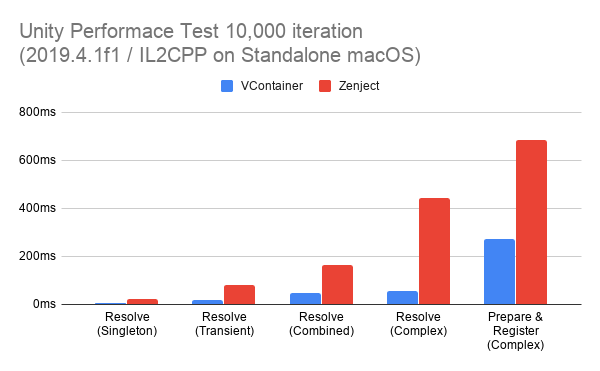
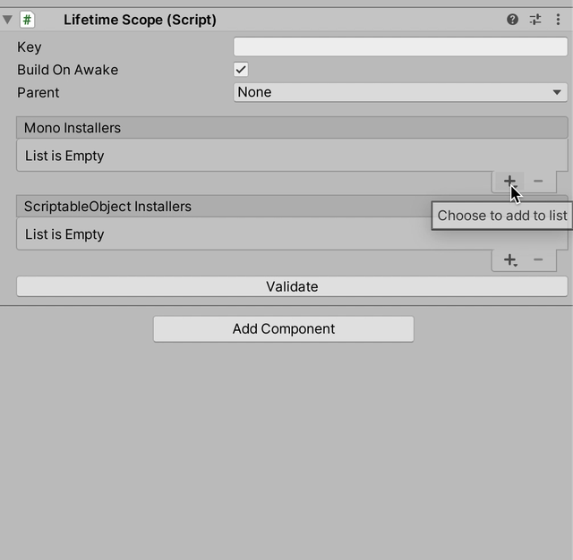
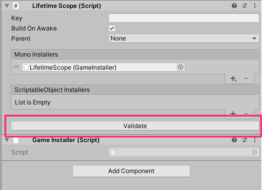
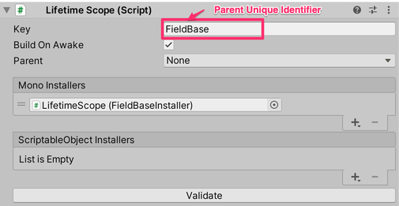
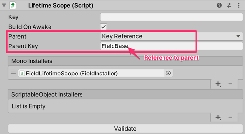

# VContainer

**VContainer** is an DI (Dependency Injection) library running on Unity (Game Engine).

"V" means making Unity's initial "U" more thinner and solid ... !

- Fast resolve. Minimum GC allocation. (For using reflection. Because it targets Unity IL2CPP.)
- Extra small code size. Few internal types.
- Application can freely create nested Lifetime Scope
- Dispatch your custom types to Unity's PlayerLoopSystem. (It is greatly influenced by Zenject)
- Immutable Container.



- This benchmark was run by [Performance Testing Extension for Unity Test Runner](https://docs.unity3d.com/Packages/com.unity.test-framework.performance@1.0/manual/index.html).  Test cases is [here](./VContainer.Benchmark).
- :warning: This benchmark does not use Zenject's Reflection baking.
  - Currently, VContainer does not support pre-build IL weaving or C# code generation optimizations, but it is planned for a future version.
  - VContainer does all type-analyze in Container Build phase. To reduce main thread blokcing time, you can consider [Async Contaienr Build](#async-contaienr-build).


And in resolve, We have zero allocation (without resolved instances).

Following is a deep profiler Unity result sample.


## Index

- [What is DI ?](#what-is-di-)
- [Installation](#installation)
- [Getting Started](#getting-started)
- [Resolving](#resolving)
- [Registering](#registering)
- [Controlling Object Lifetime](#controlling-object-lifetime)
- [Dispatching Unity Lifecycle](#dispatching-unity-lifecycle)
- [Installers](#installers)
- [Optimization](#optimization)
- [Best Practices and Recommendations](#best-practices-and-recommendations)

## What is DI ?

DI (Dependency Injection) is a general technique in OOP that all about removing uninteresting dependencies from your code.  
It brings testability, maintainability, extensibility or any kind of exchangeability to your object graph.  

In all programming paradigms, the basic design is, weak module coupling and strong module cohesion.
As you know, OOP(Object Oriented Programming) does it through objects.
1. Objects hides the details of its responsibility (encapsulation).
2. Objects transfer work outside their responsibilities to other objects

Actually, There is a problem in doing this fundamentally.  
If you write the delegation object in the class code, it means tight coupling at the source code level.
The only way to exclude a non-interesting dependency from a class is to pass from outside.

Then, if your class receives dependencies externally, need help from outside.  
DI is a technique that facilitates a place to resolve dependencies completely outside.

Terminology:
- Composition Root : The place where you make settings to resolve dependencies.
- Auto-wiring : It is a function that allows you to manage services in the container with minimal configuration. DI library usually does this.
- IoC (Inversion of Control) : Make the object with control flow responsibility an entry point. In simple and traditional programming, the entry point is where the responsibility for interrupting user input is. What this means for "Inversion".

Note:
- Don't try to DI what an object should hide inside. What's hidden is leaking and the design is getting worse.
- DI is not a specific magic. Creating your own Composition Root without using the library is called `Poor man's DI` or `DIY DI`.  This is **not** an anti-pattern.

Further reading:
- [Lightweight IoC Container for Unity - Seba's Lab](https://www.sebaslab.com/ioc-container-unity-part-1/)
- [Manning | Dependency Injection in .NET](https://www.manning.com/books/dependency-injection-in-dot-net)


## Installation

The releases page provides downloadable .unitypackage files.

## Getting Started

The basic way for integrating VContainer into your application is:

- Create `LifetimeScope` component in your scene. It has one Container and one scope.
- Write C# code to register dependencies. This is the composition root, called `Installer` like Zenject.
- Add the above installer into `LifetimeScope`.
- When playing scene, LifetimeScope automatically build Container and dispatch to the own PlayerLoopSystem.

Note:
Normally, "scope" is repeatedly created and destroyed during the game.  
`LifetimeScope` assumes this and has a parent-child relationship.

**1. Write a class that depends on other classes**

Let's say Hello world.

```csharp
namespace MyGame
{
    public class HelloWorldService
    {
        public void Hello()
        {
            UnityEngine.Debug.Log("Hello world");
        }
    }
}
```

**2. Define composition root**

Next, let's write a setting that can auto-wiring the class. This place is called an Installer.

- Right click in a folder within the Project Tab and Choose **Create -> C# Script**.
- Name it `GameInstaller.cs`.

Note that VContainer will automatically template C# scripts ending in `Installer`.

You instruct `builder` and register the class above.

```diff
using VContainer;
using VContainer.Unity;

namespace MyGame
{
    public class GameInstaller : MonoInstaller
    {
        public override void Install(IContainerBuilder builder)
        {
+            builder.Register<HelloWorldService>(Lifetime.Singleton);
        }
    }
}
```

Note:  
- VContainer always required a `Lifetime` argument explicitly. This gives us transparency and consistency.

**3. Create LifetimeScope**

Right Click inside the Hierarchy tab and select **VContainer -> Lifetime Scope**.

Then attach your installer.




**4. How to use your new HelloWorldService  ?**

Registered objects will automatically have dependency injection.
Like below:

```csharp
using VContainer;
using VContainer.Unity;

namespace MyGame
{
    public class GamePresenter
    {
        readonly HelloWorldService helloWorldService;

        public GamePresenter(HelloWorldService helloWorldService)
        {
            this.helloWorldService = helloWorldService;
        }
    }
}
```

And let's also register this class.

```diff
builder.Register<HelloWorldService>(Lifetime.Singleton);
+ builder.Register<GamePresenter>(Lifetime.Singleton);
```

Note:  
Press Validate button, you can check for missing dependencies.



**5. Execute your registerd object on PlayerLoopSystem**

To write an application in Unity, we have to interrupt Unity's lifecycle events.  
(Typically MonoBehaviour's Start / Update / OnDestroy / etc..)

Objects registered with VContainer can do this independently of MonoBehaviour.  
This is done automatically by implementing and registering some marker interfaces.

```diff
using VContainer;
using VContainer.Unity;

 namespace MyGame
 {
-    public class GamePresenter
+    public class GamePresenter : ITickable
     {
         readonly HelloWorldService helloWorldService;

         public GamePresenter(HelloWorldService helloWorldService)
         {
             this.helloWorldService = helloWorldService;
         }

+        void ITickable.Tick()
+        {
+            helloWorldService.Hello();
+        }
     }
 }
```

Now, `Tick()` will be executed at the timing of Unity's Update.

As such, it's a good practice to keep any side effect entry points through the marker interface.

We should register this as `ITickable` marker.

```csharp
builder.Register<GamePresenter>(Lifetime.Singleton)
    .As<ITickable>();
```

Marker interface is a bit noisy to specify, so we will automate it below.

```csharp
builder.Register<GamePresenter>(Lifetime.Singleton)
    .AsImplementedInterfaces();
```


**Recommendation:**
- Registering lifecycle events without relying on MonoBehaciour facilitates decupling of domain logic and presentation !


## Resolving

### Constructor Injection

VContainer automatically collects and calls registered class constructors.

Note:
- At this time, all the parameters of the constructor must be registered.
- If the dependency cannot be resolved, throws exception when validating LifetimeScope or building Container.

Here is basic idiom with DI.

```csharp
class ClassA
{
    readonly IServiceA serviceA;
    readonly IServiceB serviceB;
    readonly SomeUnityComponent component;
     
    public ClassA(
        IServiceA serviceA, 
        IServiceB serviceB,
        SomeUnityComponent component)
    {
        this.serviceA = serviceA;
        this.serviceB = serviceB;
        this.component = component;
    }
}
```

:warning: Constructors are often stripped in the IL2CPP environment.
To prevent this problem, add the `[Inject]` Attribute explicitly.

```csharp
    [Inject]
    public ClassA(
        IServiceA serviceA, 
        IServiceB serviceB,
        SomeUnityComponent component)
    {
        // ...
    }
```

Note:
- If class has multiple constructors, the one with `[Inject]` has priority.

**Recommendation:**  
Use Constructor Injection whenever possible.
The constructor & readonly field idiom is:
- The instantiated object has a compiler-level guarantee that the dependencies have been resolved.
- No magic in the class code. Instantiate easily without DI container. (e.g. Unit testing)
- If you look at the constructor, the dependency is clear.
  - If too many constructor arguments, it can be considered overly responsible.

### Method Injection

If constructor injection is not available, use method injection.

Typically this is for MonoBehaviour.

```csharp
public class SomeBehaviour : MonoBehaviour
{
    float speed;

    [Inject]
    public void Construct(GameSettings settings)
    {
        speed = settings.speed;
    }
} 
```

**Recommendation:**  
Consider whether injection to MonoBehaviour is necessary.  
In a code base where domain logic and presentation are well decoupled, MonoBehaviour should act as a View component.

In my opinion, View components should only be responsible for rendering and should be flexible.

Of course, In order for the View component to work, it needs to pass state at runtime.  
But the "state" of an object and its dependency of functionality of other objects are different.

It's enough to pass the state as arguments instead of `[Inject]`.

### Property / Field Injection

If the object has a local default and Inject is optional,  
Property/Field Injection can be used.

```csharp
class ClassA
{
    [Inject]
    IServiceA serviceA { get; set; } // Will be overwritten if something is registered. 

    public ClassA()
    {
        serviceA = ServiceA.GoodLocalDefault;
    }        
}
```

You can also use field.

```csharp
    [Inject]
    IServiceA serviceA;
```

### Implicit Relationship Types

VContainer supports automatically resolving particular types implicitly to support special relationships.

#### `IEnumerable<T>` / `IReadonlyLIst<T>`

Duplicate registered interfaces can be resolved together with IEnumerable<T> or IReadOnlyList<T>.

```csharp
builder.Register<IDisposable, A>(Lifetime.Scoped);
builder.Register<IDisposable, B>(Lifetime.Scoped);
```

```csharp
class ClassA
{
    public ClassA(IEnumerable<IDisposable> disposables) { /* ... */ }
}
```

OR

```csharp
class ClassA
{
    public ClassA(IReadOnlyList<IDisposable> disposables) { /* ... */ }
}
```

Note:
- This is mainly used by internal functions such as `ITickable` marker etc.

## Registering

### Scoping overview

- Singleton : Single instance per container (includes all parents and children).
- Transient : Instance per resolving.
- Scoped    : Instance per `LifetimeScope`.
  - If LifetimeScope is single, similar to Singleton.
  - If you create a LifetimeScope child, the instance will be different for each child.
  - When LifetimeScope is destroyed, release references and calls all the registered `IDisposable`.

See more information: [Controlling Object Lifetime](#controlling-object-lifetime)

### Register method family

There are various ways to use Register.  
Let's take the following complex type as an example.

```csharp
class ServiceA : IServiceA, IInputPort, IDisposable { /* ... */ }
```

#### Register Concrete Type

```csharp
builder.Register<ServiceA>(Lifetime.Singleton);
```

It can resolve like this:

```csharp
class ClassA
{
    public ClassA(IServiceA serviceA) { /* ... */ }
}
```

####  Register as Interface

```csharp
builder.Register<IServiceA, ServiceA>();
```

It can resolve like this:

```csharp
class ClassA
{
    public ClassA(IServiceA serviceA) { /* ... */ } 
} 
```

**Register as multiple Interface**

```csharp
builder.Register<ServiceA>(Lifetime.Singleton)
    .As<IServiceA, IInputPort>();
```

It can resolve like this:

```csharp
class ClassA
{
    public ClassA(IServiceA serviceA) { /* ... */ }
}

class ClassB
{
    public ClassB(IInputPort handlerA) { /* ... */ }
}
```

**Register all implemented interfaces automatically**

```csharp
builder.Register<ServiceA>(Lifetime.Singleton)
    .AsImplementedInterfaces();
```

It can resolve like this:

```csharp
class ClassA
{
    public ClassA(IServiceA serviceA) { /* ... */ }
}

class ClassB
{
    public ClassB(IHandlerB handlerA) { /* ... */ }
}
```

**Register all implemented interfaces and concrete type**

```csharp
builder.Register<ServiceA>(Lifetime.Singleton)
    .AsImplementedInterfaces()
    .AsSelf();
```

It can resolve like this:

```csharp
class ClassA
{
    public ClassA(IServiceA serviceA) { /* ... */ }
}

class ClassB
{
    public ClassB(IHandlerB handlerA) { /* ... */ }
}

class ClassB
{
    public ClassB(ServiceA serviceA) { /* ... */ }
}
```

#### Register instance

```csharp
// ...
var obj = new ServiceA();
// ...

builder.RegisterInstance(obj);
```

Note that `RegisterIntance` always `Scoped` lifetime. So it has no arguments.

It can resolve like this:

```csharp
class ClassA
{
    public ClassA(ServiceA serviceA) { /* ... */ }
}
```

**Register instance as interface**

```csharp
builder.RegisterInstance<IInputPort>(serviceA);

builder.RegisterInstance(serviceA)
    .As<IServiceA, IInputPort>;
    
builder.RegisterInstance()
    .AsImplementedInterfaces();    
```

#### Register type-specific parameters

If the types are not unique, but you have a dependency you want to inject at startup, you can use below:

```csharp
builder.Register<SomeService>(lifetime.Singleton)
    .WithParameter<string>("http://example.com");
```

Or, You can parameter name as a key.

```csharp
builder.Register<SomeService>(Lifetime.Singleton)
    .WithParameter("url", "http://example.com");
```


It can resolve like this:


```csharp
class SomeService
{
    public SomeService(string url) { /* ... */ }
}
```

This Register is with only `SomeService`.

```csharp
class OtherClass
{
    // ! Error 
    public OtherClass(string hogehoge) { /* ... */ }
}
```


#### Register `UnityEngine.Object`

**Register from MonoInstaller's `[SerializeField]`**

Also use `RegisterInstance()`.

```csharp
[SerializeField]
YourBehaviour yourBehaviour;

// ...

builder.RegisterInstance(yourBehaviour);
```

**Register from scene with `LifetimeScope`**

```csharp
builder.RegisterComponentInHierarchy<YourBehaviour>();
```

Note that `RegisterComponentInHierarchy` always `.Scoped` lifetime.  
Because lifetime is equal to the scene.

**Register component that Instantiate from prefab when resolving**

```csharp
[SerializeField]
YourBehaviour prefab;

// ...

builder.RegisterComponentInNewPrefab(prefab, Lifetime.Scoped);
```

**Register component that with new GameObject when resolving**

```csharp
builder.RegisterComponentOnNewGameObject<YourBehaciour>(Lifetime.Scoped, "NewGameObjectName");
```

**Register component as interface**

```csharp
builder.RegisterComponentInHierarchy<YourBehaviour>()
    .AsImplementedInterfaces();
```

**Register component to specific parent Transform**

```csharp
builder.RegisterComponentFromInNewPrefab<YourBehaviour>(Lifetime.Scoped)
    .UnderTransform(parent);

```

Or find at runtime.

```csharp
builder.RegisterComponentFromInNewPrefab<YourBehaviour>(Lifetime.Scoped)
    .UnderTransform(() => {
        // ...
        return parent;
    });

```

## Controlling Object Lifetime

`LifetimeScope` can build parent-child relationship.  
it has following behaviours:

- If registered object is not found, `LifetimeScope` will look for a parent `LifetimeScope`.
- For `Lifetime.Singleton`
  - Always returns the same instance.
  - Parent and child cannot register the same type.
- For `LifeTime.Transient`
  - Instance creating for each resolving.
  - If parent and child have the same type, child will prioritize itself.
- For `Lifetime.Scoped`:
  - Instance will be different for each child.
      - If same child, returns same instance.
      - If parent and child have the same type, child will prioritize itself.
  - When a `LifetimeScope` is destroyed, objects with `IDisposable` implemented are called `Dispose()`.

:warning: If scene is alive and only `LifetimeScope` is destroyed, MonoBehaviour registered as `Lifetime.Scoped` is not automatically destroyed.
If you want to destroy with `LifetimeScope`, make it a child transform of `LifetimeScope` or consider implement IDisposable.

### How to make an Additive scene a child

`LifetimeScope` can set a unique identifier as a character string. `Key`.  
If you want to set the relationship between `LifetimeScopes` in the scene, use the reference by keys.

In base scene.  


In additional scene.  



### How to generate child with code first

Child can also be generated from code.  
Can be used to get a reference to the `LifetimeScope` if the key is set.

```csharp
var lifetimeScope = LifetimeScpe.FindByKey("Key");
```

Or, If you have only one LifetimeScope with no keys in your scene, you can use:

```csharp
var lifetimeScope = LifetimeScope.FindDefault(scene);
```

And below is an example of creating a child.

```csharp
// Create no extra registered child
var childLifetimeScope = lifetimeScope.CreateChild();

// Create a extra registered child
var childLifetimeScope = lifetimeScope.CreateChild(builder => 
{
    builder.Register<ExtraClass>(Lifetime.Scoped);
    builder.RegisterInstance(extraInstance);
    // ...
});

// Create a extra registered child with IInstaller.
var childLifetimeScope = lifetimeScope.CreateChild(installer); 

// Create a named child 
var childLifetimeScope = lifetimeScope.CreateChild("CHILD NAME", builder => 
{
    // ...
})

// Dispose child scope
UnityEngine.Object.Destroy(childLifetimeScope.gameObject);
```

## How to add additional registers to the next scene

Often, you may want to add additional Registers to the loaded scenes.

For example, when context is finalized after assets are loaded asynchronously.

In that case you could use:

```csharp
using (LifetimeScope.Push(builder => 
{
    // Register for the next scene not yet loaded
    builder.RegisterInstance(extraInstance);
    builder.Register<ExtraType>(Lifetime.Scoped); 
}))
{
    // Load the scene here.
    var loading = SceneManager.LoadSceneAsync("NextScene");
    while (!loading.isDone)
    {
        yield return null;
    }
}
```

```csharp
// Example with UniTask
using (LifetimeScope.Push(builder => 
{
    // Register for the next scene not yet loaded
    builder.RegisterInstance(extraInstance);
    builder.Register<ExtraType>(Lifetime.Scoped); 
}))
{
    // Load the scene here
    await SceneManager.LoadSceneAsync("NextScene");
}

```

### Project Root

You can create a parent for all LifetimeScopes in your scene.

To do so, create a `LifetimeScope` prefab in a folder named `Resources` in Assets and name it "ProjectLifetimeScope".
Also use `Create -> VContaienr -> Project root LifetimeScope` .

## Dispatching Unity Lifecycle

VContainer has own PlayerLoop sub systems.

If you register a class that implements the marker interface, it will be scheduled in Unity's PlayerLoop cycle.

The following interfaces and timings are available.

- `IInitializable`     : Nearly `Start`
- `IPostInitializable` : After `Start`
- `IFixedTickable`     : Nearly `FixedUpdate`
- `IPostFixedTickable` : After `FixedUpdate`
- `ITickable`          : Nearly `Update`
- `IPostTickable`      : After `Update`
- `ILateTickable`      : Nearly `LateUpdate`
- `IPostLateTickabl`   : After `LateUpdate`

And

- `IDisposable` : With container disposes. (For `Lifetime.Scoped`)


Note:
- [Unity - Manual: Order of Execution for Event Functions](https://docs.unity3d.com/Manual/ExecutionOrder.html)

## Installers

Installer is the place to write the settings to register.

In Unity, objects depend on the scene and Assets,
It is possible to create an installer as `MonoBehaviour` and an installer as `ScriptableObject`.

Use MonoBehavoiur for Scene-dependent Installers, and ScriptableObject for scene-independent but asset-dependent projects in your project.


### `MonoInstaller`

[Getting Started](#getting-started) includes an example for this.

### `ScriptableObjectInstaller`

First, write a script like this:

```csharp
   [Serializable]
    public class CameraSettings
    {
        public float MoveSpeed = 10f;
        public float DefaultDistance = 5f;
        public float ZoomMax = 20f;
        public float ZoomMin = 5f;
    }

    [Serializable]
    public class ActorSettings
    {
        public float MoveSpeed = 0.5f;
        public float FlyingTime = 2f;
        public Vector3 FlyingInitialVelocity = Vector3.zero;
    }

    [CreateAssetMenu(fileName = "GameSettings", menuName = "MyGame/Settings")]
    public class GameSettingsInstaller : ScriptableObjectInstaller
    {
        [SerializeField]
        FieldCameraSettings cameraSettings;

        [SerializeField]
        ActorSettings actorSettings;

        public override void Install(IContainerBuilder builder)
        {
            builder.RegisterInstance(cameraSettings);
            builder.RegisterInstance(actorSettings);
        }
    }
}
```

And
- Create `GameSettingsInstaller` assets from menu.
- Attach any `LifetimeScope` it.

### `IInstaller`

Following api can receive any type implemented `IInstaller`.

- `LifetimeScope.CreateChild()`
- `LifetimeScope.Push()`

## Comparing VContainer to Zenject

Zenject is awesome. but VContainer is:
- Most parts of reflections and assertions are isolated to the Container's build stage.
- Easy to read implementation.
- Code first, transparent API.

 | Zenject                               | VContainer                                |
 |:--------------------------------------|:------------------------------------------|
 | Container.Bind\<Service\>()<br>&nbsp;&nbsp;&nbsp;&nbsp;.AsTransient() | builder.Register\<Service\>(Lifetime.Transient) |
 | Container.Bind\<Service\>()<br>&nbsp;&nbsp;&nbsp;&nbsp;.AsCached() | builder.Register\<Service\>(Lifetime.Scoped) |
 | Container.Bind\<Service\>()<br>&nbsp;&nbsp;&nbsp;&nbsp;.AsSingle() | builder.Register\<Service\>(Lifetime.Singleton) |
 | Container.Bind\<IService\>()<br>&nbsp;&nbsp;&nbsp;&nbsp;.To\<Service\>()<br>&nbsp;&nbsp;&nbsp;&nbsp;.AsCache() | builder.Register\<IService, Service\>(Lifetime.Scoped) |
 | Container.Bind(typeof(IInitializable), typeof(IDisposable))<br>&nbsp;&nbsp;&nbsp;&nbsp;.To\<Service\>()<br>&nbsp;&nbsp;&nbsp;&nbsp;.AsCached(); | builder.Register\<Service\>(Lifetime.Scoped)<br>&nbsp;&nbsp;&nbsp;&nbsp;.As\<IInitializable, IDisposable\>() |
 | Container.BindInterfacesTo\<Service\>()<br>&nbsp;&nbsp;&nbsp;&nbsp;.AsCached() | builder.Register\<Service\>(Lifetime.Scoped)<br>&nbsp;&nbsp;&nbsp;&nbsp;.AsImplementedInterfaces() |
 | Container.BindInterfacesAndSelfTo\<Foo\>()<br>&nbsp;&nbsp;&nbsp;&nbsp;.AsCached()| builder.Register\<Service\>(Lifetime.Scoped)<br>&nbsp;&nbsp;&nbsp;&nbsp;.AsImplementedInterfaces()<br>&nbsp;&nbsp;&nbsp;&nbsp;.AsSelf() |
 | Container.BindInstance(obj) | builder.RegisterInstance(obj) |
 | Container.Bind\<IService\>()<br>&nbsp;&nbsp;&nbsp;&nbsp;.FromInstance(obj) | builder.RegisterInstance\<IService\>(obj) |
 | Container.Bind(typeof(IService1), typeof(IService2))<br>&nbsp;&nbsp;&nbsp;&nbsp;.FromInstance(obj) | builder.RegisterInstance(obj)<br>&nbsp;&nbsp;&nbsp;&nbsp;.As\<IService1, IService2\>() |
 | Container.BindInterfacesTo\<Service\>()<br>&nbsp;&nbsp;&nbsp;&nbsp;.FromInstance(obj) | builder.RegisterInstance(obj)<br>&nbsp;&nbsp;&nbsp;&nbsp;.AsImplementedInterfaces() |
 | Container.BindInterfacesAndSelfTo\<Service\>()<br>&nbsp;&nbsp;&nbsp;&nbsp;.FromInstance(obj) | builder.RegisterInstance(obj)<br>&nbsp;&nbsp;&nbsp;&nbsp;.AsImplementedInterfaces()<br>&nbsp;&nbsp;&nbsp;&nbsp;.AsSelf() |
 | Container.Bind\<Foo\>()<br>&nbsp;&nbsp;&nbsp;&nbsp;.FromComponentInHierarchy()<br>&nbsp;&nbsp;&nbsp;&nbsp;.AsCached(); | builder.RegisterComponentInHierarchy\<Foo\>() |
 | Container.Bind\<Foo\>()<br>&nbsp;&nbsp;&nbsp;&nbsp;.FromComponentInNewPrefab(prefab)<br>&nbsp;&nbsp;&nbsp;&nbsp;.AsCached()<br>&nbsp;&nbsp;&nbsp;&nbsp; | builder.RegisterComponentInNewPrefab(prefab, Lifetime.Scoped)
 | Container.Bind\<Foo\>()<br>&nbsp;&nbsp;&nbsp;&nbsp;.FromNewComponentOnNewGameObject()<br>&nbsp;&nbsp;&nbsp;&nbsp;.AsCached()<br>&nbsp;&nbsp;&nbsp;&nbsp;.WithGameObjectName("Foo1") | builder.RegisterComponentOnNewGameObject\<Foo\>(Lifetime.Scoped, "Foo1") |
 | .UnderTransform(parentTransform) | .UnderTransform(parentTransform) |
 | .UnderTransform(() => parentTransform) | .UnderTransform(() => parentTransform) |
 | Container.Bind\<Foo\>()<br>&nbsp;&nbsp;&nbsp;&nbsp;.FromComponentInNewPrefabResource("Some/Path/Foo") | **Not supported**<br>We should load Resources using  `LoadAsync` family.<br>You can use `RegisterInstance()` etc after loading the Resource. |
 | Container.Bind\<Foo\>()<br>&nbsp;&nbsp;&nbsp;&nbsp;.WithId("foo").AsCached() | **Not supported**<br>Duplicate type Resolve is not recommended.<br>You can instead use type-specific Register<br>builder.Register\<Service\>(Lifetime.Scoped)<br>&nbsp;&nbsp;&nbsp;&nbsp;.WithParameter("foo", foo) |

wip

## Optimization

### Async Contaienr Build

VContainer executes pre-processing such as reflection when building a container.
To reduce main thread blocking time for your game:

1. Set `false` to `LifetimeScope.autoRun`
2. After scene loading, Call `LifetimeScope.Build` manually.

For example:

```csharp
await LoadSceneAsync(...);

var lifetimeScope = LifetimeScope.FindDefault();

// Your async solution here.
await UniTask.Run(() => lifetimeScope.Build());
```

:warning: Unity dependent features such as `builder.RegisterComponentInHierarcky()` do not work on background threads.

If this causes an error, use Awake instead.

For example:

```csharp
class GameInstaller : MonoInstaller
{
    Ground groundInScene;

    void Awake()
    {
        // Run main thread.
        groundInScene = FindObjectOfType<Ground>();
    }

    public override void Install(IContainerBuilder builder)
    {
        // It can run background thread.
        builder.RegisterInstance(groundInScene);
    }
}
```


### Parallel Container Build

If you enable `VCONTAINER_PARALLEL_CONTAINER_BUILD` compilation flag,  
VCOntainer will perform container builds in Parallel.

This is the solution when you have a lot of objects to register.

:warning: If there are few objects to register, this will be slower.

## Best Practices and Recommendations

- Use Constructor Injection whenever possible. see [Constructor Injection](#constructor-injection) section.
- Consider whether injection to MonoBehaviour is necessary. see [Method Injection](#method-injection) section.
- wip

## License

 MIT
