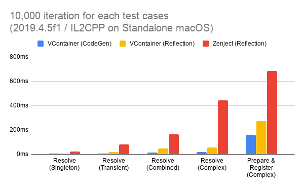
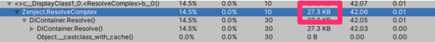
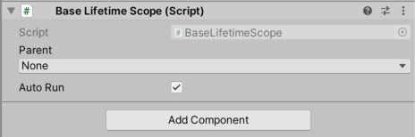
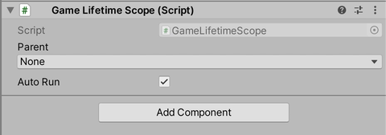
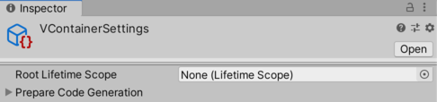
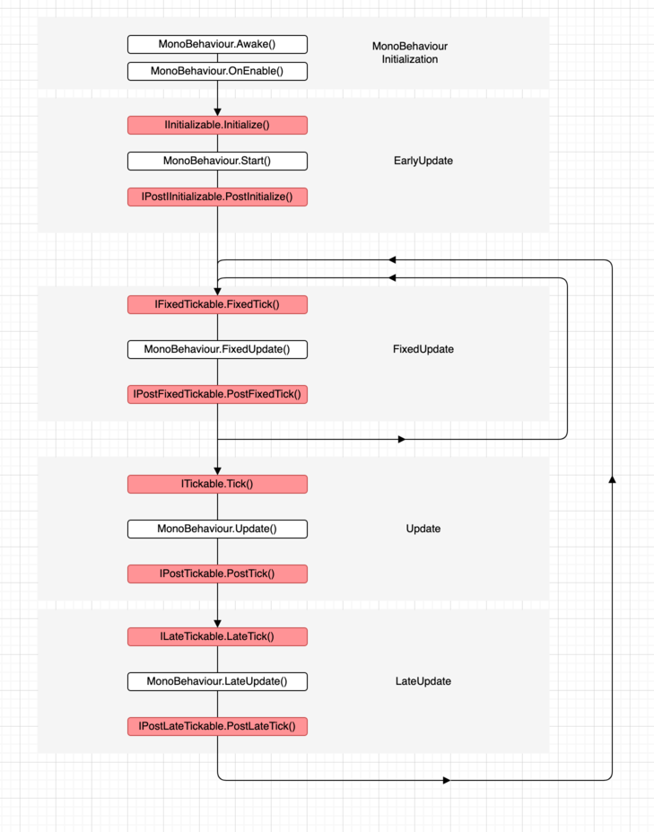
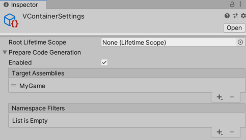

# VContainer


[](https://github.com/hadashiA/VContainer/releases)
[](https://openupm.com/packages/jp.hadashikick.vcontainer/)

**VContainer** is an DI (Dependency Injection) library running on Unity (Game Engine).

"V" means making Unity's initial "U" more thinner and solid ... !

- **Fast resolve:** Basically, 5-10x faster than Zenject.
- **Minimum GC allocation**: In Resolve, We have zero allocation without spawned instances.
- **Extra small code size**: Few internal types and few .callvirt.
- **Flexible scoping**: Application can freely create nested Lifetime Scope.
- **IoC**: Create script entry point without MonoBehaviour. (Using own Unity's PlayerLoopSystem)
- **ECS integration**
- **Immutable Container:** Thread safety and robustness.

Benchmarking:



- By default, both VContainer and Zenject use reflection at runtime.
- "VContainer (CodeGen)" means optimization feature by pre-generation IL code of Inject methods by ILPostProcessor. 
    - See [Optimization](#optimization) section  more information.

An example of profile results for GC Alloc:




(VContainer has achieved zero allocation during Resolve.)

## Index

- [What is DI ?](#what-is-di-)
- [Installation](#installation)
- [Getting Started](#getting-started)
- [Resolving](#resolving)
- [Registering](#registering)
- [Controlling Scope and Lifetime](#controlling-scope-and-lifetime)
- [Dispatching Unity Lifecycle](#dispatching-unity-lifecycle)
- [Integrating with ECS](#integrating-with-ecs)
- [Comparing VContainer to Zenject](#comparing-vcontainer-to-zenject)
- [Optimization](#optimization)
- [Best Practices and Recommendations](#best-practices-and-recommendations)

## What is DI ?

DI (Dependency Injection) is a general technique in OOP that all about removing unconcerned dependencies from your code.
It brings testability, maintainability, extensibility or any kind of exchangeability to your object graph.

In all programming paradigms, the basic design is, weak module coupling and strong module cohesion.
As you know, OOP(Object Oriented Programming) does it through objects.
1. Objects hides the details of its responsibility (encapsulation).
2. Objects transfer work outside their responsibilities to other objects

Actually, There is a problem in doing this fundamentally.
If you write the delegation object in the class code, it means tight coupling at the source code level.
The only way to exclude a unconcerned dependency from a class is to pass from outside.

Then, if your class receives dependencies externally, need help from outside.
DI is a technique that facilitates a place to resolve dependencies completely outside.

Terminology:
- **DI Container:** Have dependent references all at once and execute auto-wiring.
- **Composition Root:** The place where you make settings to resolve dependencies.
- **Auto-wiring:** It is a function that allows you to manage services in the container with minimal configuration. DI library usually does this.
- **IoC (Inversion of Control):** Make the object with control flow responsibility an entry point. In simple and traditional programming, the entry point is where the responsibility for interrupting user input is. In Unity, the entry point is `MonoBehaviour`, but in order to separate presentation and domain logic, it is effective to create an entry point that does not depend on `MonoBehaviour`.
VContainer supports this with its own PlayerLoop. See [Dispatching Unity Lifecycle](#dispatching-unity-lifecycle) section.


Note:
- Don't try to DI what an object should hide inside. What's hidden is leaking and the design is getting worse.
- The word DI does not necessarily mean magic or library. Creating your own Composition Root without using the library is called `Poor man's DI` or `DIY DI`.  This is **not** an anti-pattern.

Further reading:
- [Lightweight IoC Container for Unity - Seba's Lab](https://www.sebaslab.com/ioc-container-unity-part-1/)
- [Manning | Dependency Injection in .NET](https://www.manning.com/books/dependency-injection-in-dot-net)


## Installation

### Unity Package Manager (upm)

- `Window -> Package Manager -> +▼ -> Add package from git url`
  - `https://github.com/hadashiA/VContainer.git?path=VContainer/Assets/VContainer#1.2.0`
- Or add this to your `Package/manifest.json`
  - `"jp.hadashikick.vcontainer": "https://github.com/hadashiA/VContainer.git?path=VContainer/Assets/VContainer#1.2.0"`

### .unitypackage

The [releases](https://github.com/hadashiA/VContainer/releases) page provides downloadable .unitypackage files.

:warning: To use the unitypackage, the following entry is required in your `Package/manifest.json`.

```json
"nuget.mono-cecil": "0.1.6-preview"
```

## Getting Started

The basic way for integrating VContainer into your application is:

- Create a component that inherits `LifetimeScope` in your scene. It has one container and one scope.
- Register dependencies with C# code in a subclass of LifetimeScope. This is the composition root.
- When playing scene, LifetimeScope automatically build Container and dispatch to the own PlayerLoopSystem.

Note:
- Normally, "scope" is repeatedly created and destroyed during the game. `LifetimeScope` assumes this and has a parent-child relationship.

**1. Write a class that depends on other classes**

Let's say Hello world.

```csharp
namespace MyGame
{
    public class HelloWorldService
    {
        public void Hello()
        {
            UnityEngine.Debug.Log("Hello world");
        }
    }
}
```

**2. Define composition root**

Next, let's write a setting that can auto-wiring the class.

- Right click in a folder within the Project Tab and Choose **Create -> C# Script**.
- Name it `GameLifetimeScope.cs`.

Note:
- VContainer will automatically template C# scripts ending in `*LifetimeScope`.

You instruct `builder` and register the class above.

```diff
using VContainer;
using VContainer.Unity;

namespace MyGame
{
    public class GameLifetimeScope : LifetimeScope
    {
        protected override void Configure(IContainerBuilder builder)
        {
+            builder.Register<HelloWorldService>(Lifetime.Singleton);
        }
    }
}
```

Note:
- VContainer always required a `Lifetime` argument explicitly. This gives us transparency and consistency.

**3. Create GameObject attached your LifetimeScope**

Right Click inside the Hierarchy tab and select **Create Empty**. And name `GameLifetimeScope` it.

Then attach the Component created above.


**4. How to use your new HelloWorldService  ?**

Registered objects will automatically have dependency injection.
Like below:

```csharp
using VContainer;
using VContainer.Unity;

namespace MyGame
{
    public class GamePresenter
    {
        readonly HelloWorldService helloWorldService;

        public GamePresenter(HelloWorldService helloWorldService)
        {
            this.helloWorldService = helloWorldService;
        }
    }
}
```

And let's also register this class.

```diff
builder.Register<HelloWorldService>(Lifetime.Singleton);
+ builder.Register<GamePresenter>(Lifetime.Singleton);
```

**5. Execute your registerd object on PlayerLoopSystem**

To write an application in Unity, we have to interrupt Unity's lifecycle events.
(Typically MonoBehaviour's Start / Update / OnDestroy / etc..)

Objects registered with VContainer can do this independently of MonoBehaviour.
This is done automatically by implementing and registering some marker interfaces.

```diff
using VContainer;
using VContainer.Unity;

 namespace MyGame
 {
-    public class GamePresenter
+    public class GamePresenter : ITickable
     {
         readonly HelloWorldService helloWorldService;

         public GamePresenter(HelloWorldService helloWorldService)
         {
             this.helloWorldService = helloWorldService;
         }

+        void ITickable.Tick()
+        {
+            helloWorldService.Hello();
+        }
     }
 }
```

Now, `Tick()` will be executed at the timing of Unity's Update.

As such, it's a good practice to keep any side effect entry points through the marker interface.  

( By design, for MonoBehaviour is enough to use Start / Update etc. The marker interface of VContainer is a function to separate the entry point of domain logic and presentation logic. )

We should register this as running on Unity's life cycle events.

```diff
- builder.Register<GamePresenter>(Lifetime.Singleton);
+ builder.RegisterEntryPoint<GamePresenter>(Lifetime.Singleton)
```

Note:
- `RegisterEntryPoint<GamePresenter>(Lifetime.Singleton)` is an alias to register interfaces related to Unity's PlayerLoop event. ( Similar to `Register<GamePresenter>(Lifetime.Singleton).As<ITickable>()`)
- Registering lifecycle events without relying on MonoBehaviour facilitates decupling of domain logic and presentation !

If you have multiple EntryPoints, you can also use the following declaration as grouping.

```csharp
builder.UseEntryPoints(Lifetime.Singleton, entryPoints =>
{
    entryPoints.Add<GamePresenter>();
    // entryPoints.Add<OtherSingletonEntryPointA>();
    // entryPoints.Add<OtherSingletonEntryPointB>();
    // entryPoints.Add<OtherSingletonEntryPointC>();
})
```

This makes it clearer that EntryPoints are given special treatment by design.

## Resolving

### Constructor Injection

VContainer automatically collects and calls registered class constructors.

Note:
- At this time, all the parameters of the constructor must be registered.
- If the dependency cannot be resolved, throws exception when validating LifetimeScope or building Container.

Here is basic idiom with DI.

```csharp
class ClassA
{
    readonly IServiceA serviceA;
    readonly IServiceB serviceB;
    readonly SomeUnityComponent component;

    public ClassA(
        IServiceA serviceA,
        IServiceB serviceB,
        SomeUnityComponent component)
    {
        this.serviceA = serviceA;
        this.serviceB = serviceB;
        this.component = component;
    }
}
```

:warning: Constructors are often stripped in the IL2CPP environment.
To prevent this problem, add the `[Inject]` Attribute explicitly.

```csharp
    [Inject]
    public ClassA(
        IServiceA serviceA,
        IServiceB serviceB,
        SomeUnityComponent component)
    {
        // ...
    }
```

Note:
- If class has multiple constructors, the one with `[Inject]` has priority.

**Recommendation:**
Use Constructor Injection whenever possible.
The constructor & readonly field idiom is:
- The instantiated object has a compiler-level guarantee that the dependencies have been resolved.
- No magic in the class code. Instantiate easily without DI container. (e.g. Unit testing)
- If you look at the constructor, the dependency is clear.
  - If too many constructor arguments, it can be considered overly responsible.

### Method Injection

If constructor injection is not available, use method injection.

Typically this is for MonoBehaviour.

```csharp
public class SomeBehaviour : MonoBehaviour
{
    float speed;

    [Inject]
    public void Construct(GameSettings settings)
    {
        speed = settings.speed;
    }
}
```

**Recommendation:**
Consider whether injection to MonoBehaviour is necessary.
In a code base where domain logic and presentation are well decoupled, MonoBehaviour should act as a View component.

In my opinion, View components should only be responsible for rendering and should be flexible.

Of course, In order for the View component to work, it needs to pass state at runtime.
But the "state" of an object and its dependency of functionality of other objects are different.

It's enough to pass the state as arguments instead of `[Inject]`.

### Property / Field Injection

If the object has a local default and Inject is optional,
Property/Field Injection can be used.

```csharp
class ClassA
{
    [Inject]
    IServiceA serviceA { get; set; } // Will be overwritten if something is registered.

    public ClassA()
    {
        serviceA = ServiceA.GoodLocalDefault;
    }
}
```

You can also use field.

```csharp
    [Inject]
    IServiceA serviceA;
```

### Implicit Relationship Types

VContainer supports automatically resolving particular types implicitly to support special relationships.

#### `IEnumerable<T>` / `IReadonlyLIst<T>`

Duplicate registered interfaces can be resolved together with IEnumerable<T> or IReadOnlyList<T>.

```csharp
builder.Register<IDisposable, A>(Lifetime.Scoped);
builder.Register<IDisposable, B>(Lifetime.Scoped);
```

```csharp
class ClassA
{
    public ClassA(IEnumerable<IDisposable> disposables) { /* ... */ }
}
```

OR

```csharp
class ClassA
{
    public ClassA(IReadOnlyList<IDisposable> disposables) { /* ... */ }
}
```

Note:
- This is mainly used by internal functions such as `ITickable` marker etc.

## Registering

### Scoping overview

- Singleton : Single instance per container (includes all parents and children).
- Transient : Instance per resolving.
- Scoped    : Instance per `LifetimeScope`.
  - If LifetimeScope is single, similar to Singleton.
  - If you create a LifetimeScope child, the instance will be different for each child.
  - When LifetimeScope is destroyed, release references and calls all the registered `IDisposable`.

See more information: [Controlling Object Lifetime](#controlling-object-lifetime)

### Register method family

There are various ways to use Register.
Let's take the following complex type as an example.

```csharp
class ServiceA : IServiceA, IInputPort, IDisposable { /* ... */ }
```

#### Register Concrete Type

```csharp
builder.Register<ServiceA>(Lifetime.Singleton);
```

It can resolve like this:

```csharp
class ClassA
{
    public ClassA(ServiceA serviceA) { /* ... */ }
}
```

####  Register as Interface

```csharp
builder.Register<IServiceA, ServiceA>();
```

It can resolve like this:

```csharp
class ClassA
{
    public ClassA(IServiceA serviceA) { /* ... */ }
}
```

#### Register as multiple Interface

```csharp
builder.Register<ServiceA>(Lifetime.Singleton)
    .As<IServiceA, IInputPort>();
```

It can resolve like this:

```csharp
class ClassA
{
    public ClassA(IServiceA serviceA) { /* ... */ }
}

class ClassB
{
    public ClassB(IInputPort handlerA) { /* ... */ }
}
```

####  Register all implemented interfaces automatically

```csharp
builder.Register<ServiceA>(Lifetime.Singleton)
    .AsImplementedInterfaces();
```

It can resolve like this:

```csharp
class ClassA
{
    public ClassA(IServiceA serviceA) { /* ... */ }
}

class ClassB
{
    public ClassB(IHandlerB handlerA) { /* ... */ }
}
```

#### Register all implemented interfaces and concrete type

```csharp
builder.Register<ServiceA>(Lifetime.Singleton)
    .AsImplementedInterfaces()
    .AsSelf();
```

It can resolve like this:

```csharp
class ClassA
{
    public ClassA(IServiceA serviceA) { /* ... */ }
}

class ClassB
{
    public ClassB(IHandlerB handlerA) { /* ... */ }
}

class ClassB
{
    public ClassB(ServiceA serviceA) { /* ... */ }
}
```

#### Register lifecycle marker interfaces

```csharp
class GameController : IInitializable, ITickable, IDisposable { /* ... */ }
```

```csharp
builder.RegisterEntryPoint<GameController>(Lifetime.Singleton);
```

Note:
- this is similar to `Register<GameController>(Lifetime.Singleton).AsImplementedInterfaces()`

If you have multiple EntryPoints, you have the option to use the following declaration as grouping.

```csharp
builder.UseEntryPoints(Lifetime.Scoped, entryPoints =>
{
   entryPoints.Add<ScopedEntryPointA>();
   entryPoints.Add<ScopedEntryPointB>();
   entryPoints.Add<ScopedEntryPointC>().AsSelf();
});
```

This is the same as:

```csharp
builder.RegisterEntryPoint<ScopedEntryPointA>(Lifetime.Scoped);
builder.RegisterEntryPoint<ScopedEntryPointB>(Lifetime.Scoped);
builder.RegisterEntryPoint<ScopedEntryPointC>(Lifetime.Scoped).AsSelf();
```

#### Register instance

```csharp
// ...
var obj = new ServiceA();
// ...

builder.RegisterInstance(obj);
```

Note:
- `RegisterIntance` always `Scoped` lifetime. So it has no arguments.

It can resolve like this:

```csharp
class ClassA
{
    public ClassA(ServiceA serviceA) { /* ... */ }
}
```

####  Register instance as interface

Allow `As*` decrelations.

```csharp
builder.RegisterInstance<IInputPort>(serviceA);

builder.RegisterInstance(serviceA)
    .As<IServiceA, IInputPort>();

builder.RegisterInstance()
    .AsImplementedInterfaces();
```

#### Register type-specific parameters

If the types are not unique, but you have a dependency you want to inject at startup, you can use below:

```csharp
builder.Register<SomeService>(lifetime.Singleton)
    .WithParameter<string>("http://example.com");
```

Or, You can parameter name as a key.

```csharp
builder.Register<SomeService>(Lifetime.Singleton)
    .WithParameter("url", "http://example.com");
```


It can resolve like this:


```csharp
class SomeService
{
    public SomeService(string url) { /* ... */ }
}
```

This Register is with only `SomeService`.

```csharp
class OtherClass
{
    // ! Error
    public OtherClass(string hogehoge) { /* ... */ }
}
```

#### Register Factory

VContainer allows to register a `Func<>` delegate for the creation of an instance. This is especially useful in scenarios where instance is created at any time during execution, or multiple instances are created at any time.

By registering Factory instead of instance, you can keep the dependency static and simple.

##### Register `Func<>` Factory that requires only runtime parameters

```csharp
builder.RegisterFactory<int, Foo>(x => new Foo(x));
```

We can resolve like below:

```csharp
class ClassA
{
    readonly Func<int, Foo> factory;

    public ClassA(Func<int, Foo> factory)
    {
        this.factory = factory;
    }

    public void DoSomething()
    {
        var foo = factory.Invoke(100);
        // ...
    }
}
```

##### Register `Func<>` Factory that requires container dependencies and runtime parameters

```csharp
builder.RegisterFactory<int, Foo>(container =>
{
    var dependency = container.Resolve<Dependency>(); // Resolve per scope
    return x => new Foo(x, dependency); // Execute per factory invocation
}, Lifetime.Scoped);
```

This method required 2 params

- Func<>: Receives Container and returns Factory.

- Lifetime : Determines how often the Factory is generated. (that is, how often the outer Func is executed.)

We can resolve like below:

```csharp
class ClassA
{
    readonly Func<int, Foo> factory;

    public ClassA(Func<int, Foo> factory)
    {
        this.factory = factory;
    }

    public void DoSomething()
    {
        var foo = factory.Invoke(100);
        // ...
    }
}
```

#### Register `MonoBehaviour`

##### Register from LifetimeScope's `[SerializeField]`

```csharp
[SerializeField]
YourBehaviour yourBehaviour;

// ...

builder.RegisterComponent(yourBehaviour);
```

Note:
- `RegisterComponent` similar to `RegisterInstance`. The only difference is that MonoBehaviour registered with `RegisterComponent` will be injected even if not Resolved.

##### Register from scene with `LifetimeScope`

```csharp
builder.RegisterComponentInHierarchy<YourBehaviour>();
```

Note:
- `RegisterComponentInHierarchy` always `.Scoped` lifetime. Because lifetime is equal to the scene.

##### Register component that Instantiate from prefab when resolving

```csharp
[SerializeField]
YourBehaviour prefab;

// ...

builder.RegisterComponentInNewPrefab(prefab, Lifetime.Scoped);
```

##### Register component that with new GameObject when resolving

```csharp
builder.RegisterComponentOnNewGameObject<YourBehaviour>(Lifetime.Scoped, "NewGameObjectName");
```

##### Register component as interface

```csharp
builder.RegisterComponentInHierarchy<YourBehaviour>()
    .AsImplementedInterfaces();
```

##### Register component to specific parent Transform

```csharp
builder.RegisterComponentFromInNewPrefab<YourBehaviour>(Lifetime.Scoped)
    .UnderTransform(parent);

```

Or find at runtime.

```csharp
builder.RegisterComponentFromInNewPrefab<YourBehaviour>(Lifetime.Scoped)
    .UnderTransform(() => {
        // ...
        return parent;
    });

```

### Grouping MonoBehaviour's Registration

```csharp
builder.UseComponents(components =>
{
    components.AddInstance(yourBehaviour);
    components.AddInHierarchy<YourBehaviour>();
    components.AddFromNewPrefab(prefab, Lifetime.Scoped);
    components.AddOnNewGameObject<YourBehaviour>(Lifetime.Scoped, "name");
})
```

This is the same as:

```csharp
builder.RegisterComponent(yourBehaviour);
builder.RegisterComponentInHierarchy<YourBehaviour>();
builder.RegisterComponentFromNewPrefab(prefab, Lifetime.Scoped);
builder.RegisterComponentOnNewGameObject<YourBehaviour>(Lifetime.Scoped, "name");
```

### ScriptableObject Integration

It is useful to register the setting information saved as ScriptableObject Asset as follows.

```csharp
[Serializable]
public class CameraSettings
{
    public float MoveSpeed = 10f;
    public float DefaultDistance = 5f;
    public float ZoomMax = 20f;
    public float ZoomMin = 5f;
}

[Serializable]
public class ActorSettings
{
    public float MoveSpeed = 0.5f;
    public float FlyingTime = 2f;
    public Vector3 FlyingInitialVelocity = Vector3.zero;
}

[CreateAssetMenu(fileName = "GameSettings", menuName = "MyGame/Settings")]
public class GameSettings : ScriptableObject
{
    [SerializeField]
    public FieldCameraSettings cameraSetting

    [SerializeField]
    public ActorSettings actorSettings;
}
```

And
- Create `GameSettings` assets from menu.
- Register the created asset with LifetimeScope.

```csharp
public class SomeLifetimeScope : LifetimeScope
{
    [SerializeField]
    GameSettings settings;

    protected override void Configure(IContainerBuilder builder)
    {
        builder.RegisterInstance(settings.cameraSettings);
        builder.RegisterInstance(settings.actorSettings);
    }
}
```

## Controlling Scope and Lifetime

`LifetimeScope` can build parent-child relationship.
it has following behaviours:

- If registered object is not found, `LifetimeScope` will look for a parent `LifetimeScope`.
- For `Lifetime.Singleton`
  - Basically, always returns the same instance.
  - If parent and child have the same type, it returns the instance with the closest scope.
  - When a `LifetimeScope` is destroyed, objects with `IDisposable` implemented are called `Dispose()`.
- For `LifeTime.Transient`
  - Instance creating for each resolving.
  - If parent and child have the same registration, the child will create its own instance.
- For `Lifetime.Scoped`
  - Instance will be different for each child.
      - If same child, returns same instance.
  - If parent and child have the same registration, the child will create its own instance.
  - When a `LifetimeScope` is destroyed, objects with `IDisposable` implemented are called `Dispose()`.

:warning: If scene is alive and only `LifetimeScope` is destroyed, MonoBehaviour registered as `Lifetime.Scoped` is not automatically destroyed.
If you want to destroy with `LifetimeScope`, make it a child transform of `LifetimeScope` or consider implement IDisposable.

### How to make an Additive scene a child

#### How to set the parent when loading a scene

You can parent it by specifying a `LifetimeScope` object before loading the scene.

```csharp
class SceneLoader
{
    readonly LifetimeScope parent;
  
    public SceneLoader(LifetimeScope lifetimeScope)
    {
        parent = lifetimeScope; // Inject the LifetimeScope to which this class belongs
    }
  
    IEnumerator LoadSceneAsync()
    {
        // LifetimeScope generated in this block will be parented by `this.lifetimeScope`
        using (LifetimeScope.PushParent(parent))
        {
            // If this scene has a LifetimeScope, its parent will be `parent`.
            var loading = SceneManager.LoadSceneAsync("...", LoadSceneMode.Additive);
            while (!loading.isDone)
            {
                yield return null;
            }            
        }
    }

    // UniTask example
    async UniTask LoadSceneAsync()
    {
        using (LifetimeScope.PushParent(parent))
        {
            await SceneManager.LoadSceneAsync("...", LoadSceneMode.Additive);
        }        
    }
}
```

LifetimeScope is a GameObject, so you can also search from the scene.

```csharp
var parent = LifetimeScope.Find<BaseLifetimeScope>();
```

#### How to add additional registers to the next scene

Often, you may want to add additional Registers to the loaded scenes.

For example, when context is finalized after assets are loaded asynchronously.

In that case you could use:

```csharp
// LifetimeScopes generated during this block will be additionally Registered.
using (LifetimeScope.Push(builder =>
{
    // Register for the next scene not yet loaded
    builder.RegisterInstance(extraInstance);
}))
{
    // Loading the scene..
}
```

```csharp
// Use registration as type
class FooInstaller : IInstaller
{
    public void Install(IContainerBuilder builder)
    {
        builder.Register<ExtraType>(Lifetime.Scoped);
    }
}

using (LifetimeScope.Push(fooInstaller)
{
    // ... loading scene
}
```

```csharp
// PushParent() and Push() can be used together.
using (LifetimeScope.PushParent(parent))
using (LifetimeScope.Push(builder => ...)
{
    // ... loading scene
}
```

#### How to pre-set the parent of a scene to scene

`LifetimeScope` can be serialized by specifying the type of parent in other scenes.

In base scene.



In additional scene.



### How to generate child with code first

Child can also be generated from your C# code.

```csharp
class LevelLoader
{
    readonly LifetimeScope currentScope;
    
    LifetimeScope instantScope;
  
    public LevelLoader(LifetimeScope lifetimeScope)
    {
        currentScope = lifetimeScope;
    }
  
    public void Load()
    {
        // ... Loading some assets
      
        // Create a child scope for the container that contains this LevelLoader instance.
        instantScope = currentScopey.CreateChild();
      
        // Create with LifetimeScope prefab
        instantScope = currentScope.CreateChildFromPrefab(prefab);
            
        // Create with LifetimeScope prefab and extra registrations
        instantScope = currentScope.CreateChildFromPrefab(prefab, builder =>
        {
            builder.RegisterInstance(someExtraAsset);
            builder.RegisterEntryPoint<ExtraEntryPoint>(Lifetime.Scoped);
            // ...
        });     
      
        // Create a child scope with extra registrations
        instantScope = currentScope.CreateChild(builder =>
        {
            // ...          
        });
      
        // Create a child scope with extra registrations via `IInstaller`
        instantScope = currentScope.CreateChild(extraInstaller);
   
      
        // The additionally registered entry point runs immediately after the scope is created...
      
        // Or you can use scoped instance directly.
        var foo = instantScope.Container.Resolve<Foo>();
    }
  
    public void Unload()
    {      
        // Note that the scope implicitly create `LifetimeScope`. 
        // Use `Dispose` to safely destroying the scope.
        instantScope.Dispose();
        
        // ... Unloading some assets
    }
}
```

### How to create project root LifetimeScope

You can specify a root LifetimeScope that will be the parent of all LifetimeScopes.  


- 1. Create your root LifetimeScope prefab
- 2. Create `VContainerSettings`
    - Choose `Assets -> Create -> VContaienr -> VContainer Settings`
- 3. From your VContainerSettings inspector, set your prefab to the **Root Lifetime Scope** section.



Note:
  - If you create VContainerSettings from this menu, it will be automatically registered in preload assets.


## Dispatching Unity Lifecycle

VContainer has own PlayerLoop sub systems.

If you register a class that implements the marker interface, it will be scheduled in Unity's PlayerLoop cycle.

Since it uses PlayerLoopSystem, it works even if you register at any time (e.g: `IInitilizable` etc)


The following interfaces and timings are available.

- `IInitializable`     : Nearly `Start`
- `IPostInitializable` : After `Start`
- `IFixedTickable`     : Nearly `FixedUpdate`
- `IPostFixedTickable` : After `FixedUpdate`
- `ITickable`          : Nearly `Update`
- `IPostTickable`      : After `Update`
- `ILateTickable`      : Nearly `LateUpdate`
- `IPostLateTickabl`   : After `LateUpdate`

And

- `IDisposable` : With container disposes. (For `Lifetime.Scoped`)



Note:
- [Unity - Manual: Order of Execution for Event Functions](https://docs.unity3d.com/Manual/ExecutionOrder.html)

## Integrating with ECS

VContainer supports integration between Unity's ECS (Entity Component System) and regular C# World.  
( This is an experimental feature. Any feedback is wellcome! :0 )


:warning: Currently, this feature requires Unity 2019.3 or later versions.

### Setup

ECS features for VContainer is enabled if the project has the `com.unity.entities` package installed.  

- Currently, ECS is a preview version. You may need the settings: `[Windows] -> [Package Manager]` and `[Advanced] -> [Show preview packages]`.
- Select package of `Entities` and Press `[Install]`.

If the `com.unity.entities` package exists, the `VCONTAINER_ECS_INTEGRATION` symbol is defined and the following features are enabled.

### When using Unity's default World

By default, ECS will automatically instantiate classes that inherits the `ComponentSystemBase` defined in your project, add it to the default world, and running on it.

In this mode, you can use method injection to ECS `System`.
( The constructor is automatically used by Unity, so it cannot be used.)

```csharp
class SystemA : SystemBase
{
    [Inject]
    public void Construct(Settings settings)
    {
        // ...
    }
    
    protected override void OnUpdate()
    {
        // ...
    }
    
}
```

```csharp
// Inject the `System` to Unity's default World
builder.RegisterSystemFromDefaultWorld<SystemA>();

// builder.RegisterSystemFromDefaultWorld<SystemB>();
// builder.RegisterSystemFromDefaultWorld<SystemC>();

// Other dependencies can be injected into the System.
builder.RegisterInstance(settings);
// ...
```

(Optional) The above can also be declared by grouping as below:

```csharp
builder.UseDefaultWorld(systems =>
{
    systems.Add<SystemA>();
    
    // systems.Add<SystemB>();
    // systems.Add<SystemC>();
    // ...
});
```

Internaly, this is an automation of the following processes:

```csharp
var system = World.DefaultGameObjectInjectionWorld.GetExistingSystem<SystemA>();
system.Construct(settings);
```

Note:
- In default (`UNITY_DISABLE_AUTOMATIC_SYSTEM_BOOTSTRAP` is **not** used), The SystemGroup to which the System belongs can be controlled by Attribute ( e.g: `[UpdateInGroup(typeof(SystemGroupType))]` .


#### Example of setup entities (with Default World)

```csharp
public class GameLifetimeScope : LifetimeScope
{
    protected override void Configure(IContainerBuilder builder)
    {
        builder.UseDefaultWorld(systems =>
        {
            systems.Add<SystemA>();
        })
    }
}
```

```csharp
public class SystemA : SystemBase
{
    [Inject]
    public void Construct(Foo foo)
    {
        // Setup entities...
        var archtype = World.EntityManager.CreateArchetype(typeof(ComponentDataA));
        World.EntityManager.CreateEntity(archtype);
    }
    protected override void OnUpdate()
    {
        Entities.ForEach((ref ComponentDataA data) =>
            {
                // Do something...
            })
            .Schedule();
    }
}
```

### When to use your custom world

ECS also allows you to create and register your own system.

There are two ways to disable Unity's automatic system bootstrap.

- By setting the define symbol `UNITY_DISABLE_AUTOMATIC_SYSTEM_BOOTSTRAP` will disable all World and System auto-bootstrap.
- Or, By adding the `[DisableAutoCreation]` attribute to the class definition to disable auto bootstrap per system.

For System that have auto bootstrap disabled, constructor injection can be used. 

```csharp
public class SystemA : SystemBase
{
    readonly ServiceA serviceA;

    // Constructor injection
    public SampleSystem(ServiceA serviceA)
    {
        this.serviceA = serviceA;
    }

    protected override void OnUpdate()
    {
        // ...
    }
}
```

To use this System, you need to set up World yourself.

VContainer supports to instantiate of World and configuration.

```csharp
// Register of new World under the control of VContainer.
builder.RegisterNewWorld("My World 1", Lifetime.Scoped);

// Register System by specifying the name of World to be added.
builder.RegisterSystemIntoWorld<SystemA>("My World 1");
// builder.RegisterSystemIntoWorld<SystemB>("My World 1");
// builder.RegisterSystemIntoWorld<SystemC>("My World 1");

// Other dependencies can be injected into the System.
builder.Register<ServiceA>(Lifetime.Singleton);
```

(Optional) The above can also be declared by grouping as below:

```csharp
builder.UseNewWorld("My World 1", Lifetime.Scoped, systems =>
{
    systems.Add<SystemA>();
    
    // systems.Add<SystemB>();
    // systems.Add<SystemC>();
    // ...
});
```

Internaly, If you use above methods, the following setup will be performed automatically:

```csharp
// When resolving world ...

var world = new World("My World 1");

world.CreateSystem<InitializationSystemGroup>();
world.CreateSystem<SimulationSystemGroup>();
world.CreateSystem<PresentationSystemGroup>();

ScriptBehaviourUpdateOrder.UpdatePlayerLoop(world, PlayerLoop.GetCurrentPlayerLoop());

// Resolving dependencies ...
var systemA = new SystemA(new ServiceA());
world.AddSystem(systemA);

var systemGroup = (ComponentSystemGroup)world.GetOrCreateSystem<SimulationSystemGroup>();
systemGroup.AddSystemToUpdateList(systemA);


// After container build ...

foreach (var system in world.Systems)
{
    if (system is ComponentSystemGroup group)
        group.SortSystems();
}
```

Note:
- Currently, VContainer is registering the World using `ScriptBehaviourUpdateOrder.UpdatePlayerLoop`.
- This is an alias that registers 3 SystemGroups to PlayerLoop, so VContainer also creates these SystemGroups internally.


By default, VContainer will register System to `SimulationSystemGroup`. If you want to change this, you can use `.IntoGroup<T>()`:

```csharp
// Example
builder.RegisterSystemIntoWorld<SystemA>("My World 1")
    .IntoGroup<PresentationSystemGroup>();
```

#### Lifeime of World and Systems

`RegisterNewWorld(...)` or `UseNewWorld(...)` can accept Lifetime as an argument.  

- This new World  is placed under the control of VContainer.
- World holds System. Therefore, the lifetime of System is the same as World. 
- If `Lifetime.Scoped` is specified, when the scope is destroyed, Dispose of all the systems belonging to that World will be called.


```csharp
builder.RegisterNewWorld("My World 1", Lifetime.Scoped);
builder.RegisterSystemIntoWorld("My World 1");
```

```csharp
public class SystemA : SystemBase, IDisposable
{
    protected override void OnUpdate()
    {
        // ...
    }
    
    // Called when scope is disposed.
    public void Dispose()
    {
        // ...
    }
}
```

#### Example of setup entities (with Custom World)

```csharp
public class GameLifetimeScope : LifetimeScope
{
    protected override void Configure(IContainerBuilder builder)
    {
        builder.UseNewWorld("My World 1", Lifetime.Scoped, systems =>
        {
            systems.Add<SystemA>();
        })
    }
}
```

```csharp
public class SystemA : SystemBase
{
    public void SystemA(Foo foo)
    {
        // Injected dependencies...
    }

    protected override void OnCreate()
    {
        // Setup entities...
        var archtype = World.EntityManager.CreateArchetype(typeof(ComponentDataA));
        World.EntityManager.CreateEntity(archtype);
    }

    protected override void OnUpdate()
    {
        Entities.ForEach((ref ComponentDataA data) =>
            {
                // Do something...
            })
            .Schedule();
    }
}
```

### Resolving `World`

```csharp
// When only one world is registered:
class ClassA
{
    public ClassA(World world) { /* ... */ }
}

// When multiple worlds is registered
class ClassA
{
    public ClassA(IEnumerable<World> worlds)
    {
        var world = worlds.First(x => x.Name == "My new world");
        // ...
    }
}
```


## Comparing VContainer to Zenject

Zenject is awesome. but VContainer is:
- Most parts of reflections and assertions are isolated to the Container's build stage.
- Easy to read implementation.
- Code first, transparent API.

| Zenject                               | VContainer                                |
|:--------------------------------------|:------------------------------------------|
| Container.Bind\<Service\>()<br>&nbsp;&nbsp;&nbsp;&nbsp;.AsTransient() | builder.Register\<Service\>(Lifetime.Transient) |
| Container.Bind\<Service\>()<br>&nbsp;&nbsp;&nbsp;&nbsp;.AsCached() | builder.Register\<Service\>(Lifetime.Scoped) |
| Container.Bind\<Service\>()<br>&nbsp;&nbsp;&nbsp;&nbsp;.AsSingle() | builder.Register\<Service\>(Lifetime.Singleton) |
| Container.Bind\<IService\>()<br>&nbsp;&nbsp;&nbsp;&nbsp;.To\<Service\>()<br>&nbsp;&nbsp;&nbsp;&nbsp;.AsCache() | builder.Register\<IService, Service\>(Lifetime.Scoped) |
| Container.Bind(typeof(IInitializable), typeof(IDisposable))<br>&nbsp;&nbsp;&nbsp;&nbsp;.To\<Service\>()<br>&nbsp;&nbsp;&nbsp;&nbsp;.AsCached(); | builder.Register\<Service\>(Lifetime.Scoped)<br>&nbsp;&nbsp;&nbsp;&nbsp;.As\<IInitializable, IDisposable\>() |
| Container.BindInterfacesTo\<Service\>()<br>&nbsp;&nbsp;&nbsp;&nbsp;.AsCached() | builder.Register\<Service\>(Lifetime.Scoped)<br>&nbsp;&nbsp;&nbsp;&nbsp;.AsImplementedInterfaces() |
| Container.BindInterfacesAndSelfTo\<Foo\>()<br>&nbsp;&nbsp;&nbsp;&nbsp;.AsCached()| builder.Register\<Service\>(Lifetime.Scoped)<br>&nbsp;&nbsp;&nbsp;&nbsp;.AsImplementedInterfaces()<br>&nbsp;&nbsp;&nbsp;&nbsp;.AsSelf() |
| Container.BindInstance(obj) | builder.RegisterInstance(obj) |
| Container.Bind\<IService\>()<br>&nbsp;&nbsp;&nbsp;&nbsp;.FromInstance(obj) | builder.RegisterInstance\<IService\>(obj) |
| Container.Bind(typeof(IService1), typeof(IService2))<br>&nbsp;&nbsp;&nbsp;&nbsp;.FromInstance(obj) | builder.RegisterInstance(obj)<br>&nbsp;&nbsp;&nbsp;&nbsp;.As\<IService1, IService2\>() |
| Container.BindInterfacesTo\<Service\>()<br>&nbsp;&nbsp;&nbsp;&nbsp;.FromInstance(obj) | builder.RegisterInstance(obj)<br>&nbsp;&nbsp;&nbsp;&nbsp;.AsImplementedInterfaces() |
| Container.BindInterfacesAndSelfTo\<Service\>()<br>&nbsp;&nbsp;&nbsp;&nbsp;.FromInstance(obj) | builder.RegisterInstance(obj)<br>&nbsp;&nbsp;&nbsp;&nbsp;.AsImplementedInterfaces()<br>&nbsp;&nbsp;&nbsp;&nbsp;.AsSelf() |
| Container.Bind\<Foo\>()<br>&nbsp;&nbsp;&nbsp;&nbsp;.FromComponentInHierarchy()<br>&nbsp;&nbsp;&nbsp;&nbsp;.AsCached(); | builder.RegisterComponentInHierarchy\<Foo\>() |
 | Container.Bind\<Foo\>()<br>&nbsp;&nbsp;&nbsp;&nbsp;.FromComponentInNewPrefab(prefab)<br>&nbsp;&nbsp;&nbsp;&nbsp;.AsCached()<br>&nbsp;&nbsp;&nbsp;&nbsp; | builder.RegisterComponentInNewPrefab(prefab, Lifetime.Scoped)
 | Container.Bind\<Foo\>()<br>&nbsp;&nbsp;&nbsp;&nbsp;.FromNewComponentOnNewGameObject()<br>&nbsp;&nbsp;&nbsp;&nbsp;.AsCached()<br>&nbsp;&nbsp;&nbsp;&nbsp;.WithGameObjectName("Foo1") | builder.RegisterComponentOnNewGameObject\<Foo\>(Lifetime.Scoped, "Foo1") |
 | .UnderTransform(parentTransform) | .UnderTransform(parentTransform) |
 | .UnderTransform(() => parentTransform) | .UnderTransform(() => parentTransform) |

<table style="height: 0 auto;">
<tr>
  <th>Zenject</th>
  <th>VContainer</th>
</tr>
<tr>
<td>

```csharp
Container.Bind<Foo>()
    .FromComponentInNewPrefabResource("Some/Path/Foo")
```

</td>
<td>

#### Not supported</b>

We should load Resources using LoadAsync family.
You can use RegisterInstance() etc after loading the Resource.

</td>
</tr>

<tr>
<td>

```csharp
Container.Bind<Foo>()
    .WithId("foo").AsCached()
```

</td>
<td>

#### Not supported

Duplicate type Resolve is not recommended.
You can instead use type-specific Register
builder.Register<Service>(Lifetime.Scoped)
    .WithParameter("foo", foo)

</td>
</tr>

<table style="height: 0 auto;">
<tr>
  <th>Zenject</th>
  <th>VContainer</th>
</tr>
<tr>
<td>

```csharp
public class Enemy
{
    readonly float speed;

    public Enemy(float speed)
    {
        this.speed = speed;
    }

    public class Factory : PlaceholderFactory<float, Enemy>;
    {
    }
}

Container.BindFactory<float, Enemy, Enemy.Factory>();
```

</td>   
<td>

```csharp
public class Enemy
{
    readonly float speed;

    public Enemy(float speed)
    {
        this.speed = speed;
    }
}

builder.RegisterFactory<float, Enemy>(speed => new Enemy(speed));
```

</td>
<tr>
<td>

```csharp
public class Enemy
{
    readonly Player player;
    readonly float speed;

    public Enemy(float speed, Player player)
    {
        this.player = player;
        this.speed = speed;
    }

    public class Factory : PlaceholderFactory<float, Enemy>;
    {
    }
}

Container.BindFactory<float, Enemy, Enemy.Factory>();
```

</td>
<td>

```csharp
public class Enemy
{
    readonly Player player;
    readonly float speed;

    public Enemy(float speed, Player player)
    {
        this.player = player;
        this.speed = speed;
    }
}

builder.RegisterFactory<float, Enemy>(container =>
{
    var player = container.Resolve<Player>();
    return speed => new Enemy(speed, player);
}, Lifetime.Scoped);
```

</td>
</tr>
<tr>
<td>

```csharp
public class Enemy : MonoBehaviour
{
    Player player;

    [Inject]
    public void Construct(Player player)
    {
        this.player = player;
    }

    public class Factory : PlaceholderFactory<Enemy>
    {
    }
}

Container.BindFactory<Enemy, Enemy.Factory>()
    .FromComponentInNewPrefab(enemyPrefab);
```

</td>
<td>

```csharp
public class Enemy : MonoBehaviour
{
    Player player;

    public void Construct(Player player)
    {
        this.player = player;
    }
}

builder.RegisterFactory<Enemy>(container =>
{
    var player = container.Resolve<Player>();
    return () =>
    {
        var enemy = Instantiate(enemyPrefab);
        enemy.Construct(player);
        return enemy;
    };
}, Lifetime.Scoped);
```

</td>
</tr>
</table>


## Optimization

### Pre IL Code Generation

:warning: this feature requires Unity 2019.3 or later.

VContainer has the ability to perform the meta programming part faster by generating IL code at compile time.  
As a result, there is no reflection at runtime, and it is expected to be 3-6x faster.  
It works in the IL2CPP environment.

With VContainer, for example, the following code (as IL) is automatically generated:

```csharp
class ClassA
{
    private sealed class __GeneratedInjector : IInjector
    {
        public object CreateInstance(IObjectResolver resolver, IReadOnlyList<IInjectParameter> parameters)
        {
            I6 fromConstructor = resolver.ResolveOrParameter<I6>("fromConstructor1", parameters);
            I7 fromConstructor2 = resolver.ResolveOrParameter<I7>("fromConstructor2", parameters);
            return new ClassA(fromConstructor, fromConstructor2);
        }

        public void Inject(object instance, IObjectResolver resolver, IReadOnlyList<IInjectParameter> parameters)
        {
            ClassA clasA = (ClassA)instance;
            I3 service = resolver.ResolveOrParameter<I3>("service3", parameters);
            I4 service2 = resolver.ResolveOrParameter<I4>("service4", parameters);
            allInjectionFeatureService.MethodInjectable1(service, service2);
            I5 service3 = resolver.ResolveOrParameter<I5>("service5", parameters);
            I6 service4 = resolver.ResolveOrParameter<I6>("service6", parameters);
            classA.MethodInjectable2(service3, service4);
            classA.PrivatePropertyInjectable = resolver.Resolve<I2>();
            classA.PublicPropertyInjectable = resolver.Resolve<I3>();
            classA.privateFieldInjectable = resolver.Resolve<I4>();
            classA.PublicFieldInjectable = resolver.Resolve<I5>();
        }
   }
```

#### How to enable code generation mode

##### 1. Add VContainerSettings in your project

Choose `Assets -> Create -> VContainer -> VContainer Settings`.  
And select directory.

Note:
- This menu will automatically add VContainerSettings to preload-assets.

##### 2. Specify target assemblies

Set the following from the inspector of VContainerSettings.asset.



- Prepare Code Generation section
  - **Enabled** : enable/disable code generation feature at build time.
  - **Target Assemblies** : Specify the assembly you want to pre-IL generate.
      - "+" button shows valid choices
      - The Assembly specified here must reference VContainer.dll. 
      - If not specified, no pre-code generation will be done
  - **Namespace Filter** : You can filter the target by specifying namespace.
      - "+" button shows valid choices.
      
#### 3. Build your assembly      

The next time the specified assembly is compiled, VContainer will make changes to the compiled dll.

If it succeeds, it will be logged. For example:

> VContainer code generation optimization for MyGame.dll 24 types (40.0355ms)


VContainer code generation optimization for VContainer.Benchmark.Fixtures 24 types (40.0355ms)


### Async Contaienr Build

VContainer executes pre-processing such as reflection when building a container.
To reduce main thread blocking time for your game:

1. Set `false` to `LifetimeScope.autoRun`
2. After scene loading, Call `LifetimeScope.Build` manually.

For example:

```csharp
var nextScene = await LoadSceneAsync(...);

var lifetimeScope = LifetimeScope.Find<MyLifetimeScope>(nextScene.Scene);

// Your async solution here.
await UniTask.Run(() => lifetimeScope.Build());
```

:warning: Unity dependent features such as `builder.RegisterComponentInHierarcky()` do not work on background threads.

If this causes an error, use Awake instead.

For example:

```csharp
class GameLifetimeScope : LifetimeScope
{
    Ground groundInScene;

    protected override void Awake()
    {
        // Run main thread.
        groundInScene = FindObjectOfType<Ground>();

        base.Awake();
    }

    protected override void Configure(IContainerBuilder builder)
    {
        // It can run background thread.
        builder.RegisterInstance(groundInScene);
    }
}
```


### Parallel Container Build

If you enable `VCONTAINER_PARALLEL_CONTAINER_BUILD` compilation flag,
VContainer will perform container builds in Parallel.

This is the solution when you have a lot of objects to register.

:warning: If there are few objects to register, this will be slower.

## Best Practices and Recommendations

- Use Constructor Injection whenever possible. see [Constructor Injection](#constructor-injection) section.
- Consider whether injection to MonoBehaviour is necessary. see [Method Injection](#method-injection) section.
- wip

## License

 MIT
