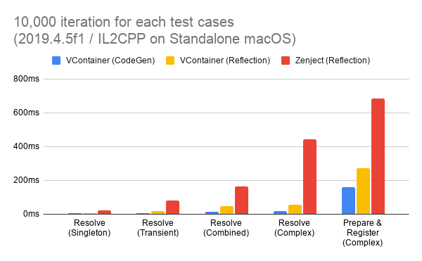
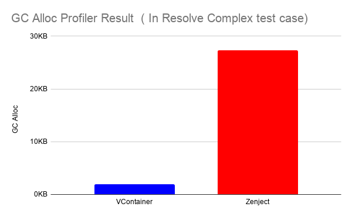

# VContainer


[](https://github.com/hadashiA/VContainer/releases)
[](https://openupm.com/packages/jp.hadashikick.vcontainer/)

The extra fast DI (Dependency Injection) library running on Unity Game Engine.

"V" means making Unity's initial "U" more thinner and solid ... !

- **Fast Resolve:** Basically 5-10x faster than Zenject.
- **Minimum GC Allocation:** In Resolve, we have **zero allocation** without spawned instances.
- **Small code size:** Few internal types and few .callvirt.
- **Assisting correct DI way:** Provides simple and transparent API, and carefully select features. This prevents the DI declaration from becoming overly complex.
- **Immutable Container:** Thread safety and robustness.

## Features

- Constructor Injection / Method Injection / Property & Field Injection
- Dispatch own PlayerLoopSystem
- Flexible scoping
  - Application can freely create nested Lifetime Scope with any async way for you like.
- Accelerated mode with SourceGenerator (Optional)
- Diagnositcs window on unity editor
- UniTask Integration
- ECS Integration *beta*

## Documentation

Visit [vcontainer.hadashikick.jp](https://vcontainer.hadashikick.jp) to view the full documentation.

## Performance



### GC Alloc Result Example




## Installation

*Requires Unity 2018.4+*

### Install via UPM (using Git URL)

1. Navigate to your project's Packages folder and open the manifest.json file.
2. Add this line below the "dependencies": { line
    - ```json title="Packages/manifest.json"
      "jp.hadashikick.vcontainer": "https://github.com/hadashiA/VContainer.git?path=VContainer/Assets/VContainer#1.16.8",
      ```
3. UPM should now install the package.

### Install via OpenUPM


1. The package is available on the [openupm registry](https://openupm.com). It's recommended to install it via [openupm-cli](https://github.com/openupm/openupm-cli).
2. Execute the openum command.
    - ```
      openupm add jp.hadashikick.vcontainer
      ```

### Install manually (using .unitypackage)

1. Download the .unitypackage from [releases](https://github.com/hadashiA/VContainer/releases) page.
2. Open VContainer.x.x.x.unitypackage

## Basic Usage

First, create a scope. References are automatically resolved for types registered here.

```csharp
public class GameLifetimeScope : LifetimeScope
{
    public override void Configure(IContainerBuilder builder)
    {
        builder.RegisterEntryPoint<ActorPresenter>();

        builder.Register<CharacterService>(Lifetime.Scoped);
        builder.Register<IRouteSearch, AStarRouteSearch>(Lifetime.Singleton);

        builder.RegisterComponentInHierarchy<ActorsView>();
        
        // Register with enum Keys
        builder.Register<IWeapon, Sword>(Lifetime.Singleton).Keyed(WeaponType.Primary);
        builder.Register<IWeapon, Bow>(Lifetime.Singleton).Keyed(WeaponType.Secondary);
        builder.Register<IWeapon, MagicStaff>(Lifetime.Singleton).Keyed(WeaponType.Special);
    }
}
```

Where definitions of classes are

```csharp
// Define an enum for weapon types
public enum WeaponType
{
    Primary,
    Secondary,
    Special
}

public interface IRouteSearch
{
}

public class AStarRouteSearch : IRouteSearch
{
}

public class CharacterService
{
    readonly IRouteSearch routeSearch;

    public CharacterService(IRouteSearch routeSearch)
    {
        this.routeSearch = routeSearch;
    }
}
```

```csharp
public class ActorsView : MonoBehaviour
{
}
```

and

```csharp
public class ActorPresenter : IStartable
{
    readonly CharacterService service;
    readonly ActorsView actorsView;
    readonly IWeapon primaryWeapon;
    readonly IWeapon secondaryWeapon;
    readonly IWeapon specialWeapon;

    public ActorPresenter(
        CharacterService service,
        ActorsView actorsView,
        [Key(WeaponType.Primary)] IWeapon primaryWeapon,
        [Key(WeaponType.Secondary)] IWeapon secondaryWeapon,
        [Key(WeaponType.Special)] IWeapon specialWeapon)
    {
        this.service = service;
        this.actorsView = actorsView;
        this.primaryWeapon = primaryWeapon;
        this.secondaryWeapon = secondaryWeapon;
        this.specialWeapon = specialWeapon;
    }

    void IStartable.Start()
    {
        // Scheduled at Start () on VContainer's own PlayerLoopSystem.
    }
}
```

You can also resolve with object-based Key directly from the container:

```csharp
// Resolve by Key
var primaryWeapon = container.Resolve<IWeapon>(WeaponType.Primary);
var secondaryWeapon = container.Resolve<IWeapon>(WeaponType.Secondary);

// Try resolve with Key
if (container.TryResolve<IWeapon>(WeaponType.Special, out var specialWeapon))
{
    // Use specialWeapon
}

// Other supported Key types include strings and integers
builder.Register<IEnemy, Goblin>(Lifetime.Singleton).Keyed(1);  // Integer Key
builder.Register<IEnemy, Orc>(Lifetime.Singleton).Keyed("boss");  // String Key
var goblin = container.Resolve<IEnemy>(1);
var boss = container.Resolve<IEnemy>("boss");
```

The `Key` attribute supports injection with identifiers. You can use it in the constructor, method, or property:

```csharp
// Field injection with Key
public class WeaponHolder
{
    [Inject, Key(WeaponType.Primary)]
    public IWeapon PrimaryWeapon;
    
    [Inject, Key(WeaponType.Secondary)]
    public IWeapon SecondaryWeapon;
}

// Property injection with Key
public class EquipmentManager
{
    [Inject, Key(WeaponType.Primary)]
    public IWeapon PrimaryWeapon { get; set; }
    
    [Inject, Key(WeaponType.Secondary)]
    public IWeapon SecondaryWeapon { get; set; }
}

// Method injection with Key
public class CharacterEquipment
{
    public IWeapon PrimaryWeapon { get; private set; }
    public IWeapon SecondaryWeapon { get; private set; }
    
    [Inject]
    public void Initialize(
        [Key(WeaponType.Primary)] IWeapon primaryWeapon,
        [Key(WeaponType.Secondary)] IWeapon secondaryWeapon)
    {
        PrimaryWeapon = primaryWeapon;
        SecondaryWeapon = secondaryWeapon;
    }
}
```

- In this example, the routeSearch of CharacterService is automatically set as the instance of AStarRouteSearch when CharacterService is resolved.
- Further, VContainer can have a Pure C# class as an entry point. (Various timings such as Start, Update, etc. can be specified.) This facilitates "separation of domain logic and presentation".
- With the `Keyed` method and `Key` attribute, you can register and resolve multiple implementations of the same interface with object-based identifiers (including enums, strings, and integers).

### Flexible Scoping with async

LifetimeScope can dynamically create children. This allows you to deal with the asynchronous resource loading that often occurs in games.

```csharp
public void LoadLevel()
{
    // ... Loading some assets

    // Create a child scope
    instantScope = currentScope.CreateChild();

    // Create a child scope with LifetimeScope prefab
    instantScope = currentScope.CreateChildFromPrefab(lifetimeScopePrefab);

    // Create a child with additional registration
    instantScope = currentScope.CreateChildFromPrefab(
        lifetimeScopePrefab,
        builder =>
        {
            // Extra Registrations ...
        });

    instantScope = currentScope.CreateChild(builder =>
    {
        // ExtraRegistrations ...
    });

    instantScope = currentScope.CreateChild(extraInstaller);
}

public void UnloadLevel()
{
    instantScope.Dispose();
}
```

In addition, you can create a parent-child relationship with LifetimeScope in an Additive scene.

```csharp
class SceneLoader
{
    readonly LifetimeScope currentScope;

    public SceneLoader(LifetimeScope currentScope)
    {
        this.currentScope = currentScope; // Inject the LifetimeScope to which this class belongs
    }

    IEnumerator LoadSceneAsync()
    {
        // LifetimeScope generated in this block will be parented by `this.lifetimeScope`
        using (LifetimeScope.EnqueueParent(currentScope))
        {
            // If this scene has a LifetimeScope, its parent will be `parent`.
            var loading = SceneManager.LoadSceneAsync("...", LoadSceneMode.Additive);
            while (!loading.isDone)
            {
                yield return null;
            }
        }
    }

    // UniTask example
    async UniTask LoadSceneAsync()
    {
        using (LifetimeScope.EnqueueParent(parent))
        {
            await SceneManager.LoadSceneAsync("...", LoadSceneMode.Additive);
        }
    }
}
```

```csharp
// LifetimeScopes generated during this block will be additionally Registered.
using (LifetimeScope.Enqueue(builder =>
{
    // Register for the next scene not yet loaded
    builder.RegisterInstance(extraInstance);
}))
{
    // Loading the scene..
}
```

See [scoping](https://vcontainer.hadashikick.jp/scoping/lifetime-overview) for more information.

## UniTask

```csharp
public class FooController : IAsyncStartable
{
    public async UniTask StartAsync(CancellationToken cancellation)
    {
        await LoadSomethingAsync(cancellation);
        await ...
        ...
    }
}
```

```csharp
builder.RegisterEntryPoint<FooController>();
```

See [integrations](https://vcontainer.hadashikick.jp/integrations/unitask) for more information.


## Diagnostics Window


See [diagnostics](https://vcontainer.hadashikick.jp/diagnostics/diagnostics-window) for more information.

## Credits

VContainer is inspired by:

- [Zenject](https://github.com/modesttree/Zenject) / [Extenject](https://github.com/svermeulen/Extenject).
- [Autofac](http://autofac.org) - [Autofac Project](https://github.com/autofac/Autofac).
- [MicroResolver](https://github.com/neuecc/MicroResolver)

## Author

[@hadashiA](https://twitter.com/hadashiA)

## License

MIT
