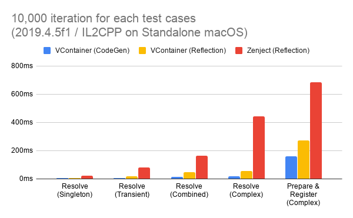
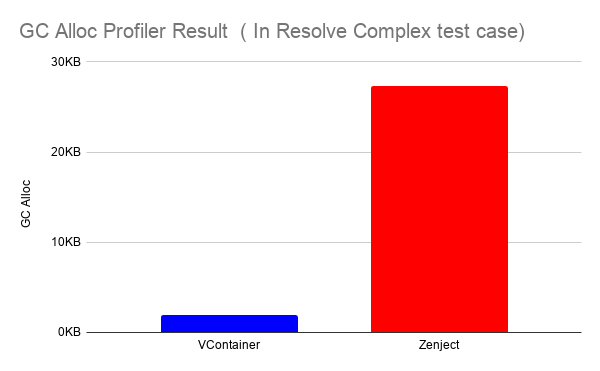
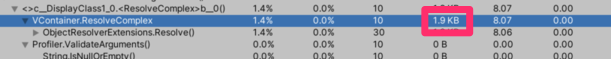
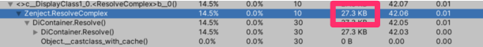
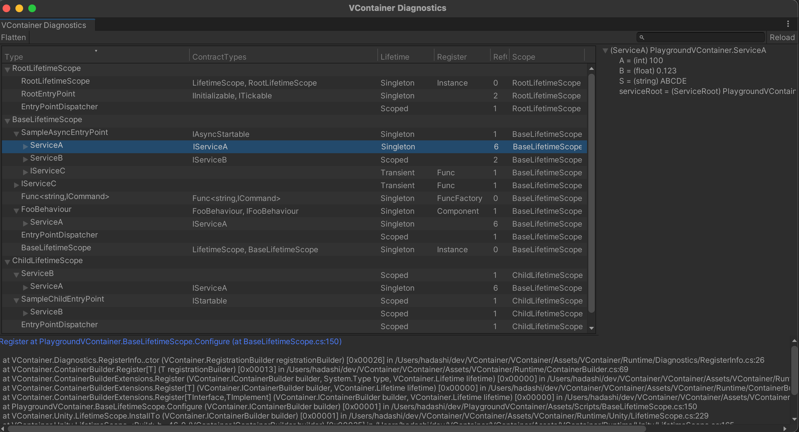

# VContainer\n\n\n\n[](https://github.com/hadashiA/VContainer/releases)\n[](https://openupm.com/packages/jp.hadashikick.vcontainer/)\n\n\u8fd0\u884c\u5728 Unity \u6e38\u620f\u5f15\u64ce\u4e0a\u7684\u8d85\u5feb\u901f DI\uff08\u4f9d\u8d56\u6ce8\u5165\uff09\u5e93\u3002\n\n\"V\" \u4ee3\u8868\u7740\u8ba9 Unity \u539f\u672c\u7684 \"U\" \u53d8\u5f97\u66f4\u8f7b\u3001\u66f4\u575a\u56fa ... \uff01\n\n- **\u5feb\u901f\u89e3\u6790\uff1a** \u6bd4 Zenject \u5feb 5-10 \u500d\u3002\n- **\u6781\u4f4e GC \u5206\u914d\uff1a** \u5728\u4e0d\u751f\u6210\u65b0\u5b9e\u4f8b\u7684\u60c5\u51b5\u4e0b\uff0cResolve \u8fc7\u7a0b\u8fbe\u5230 **\u96f6\u5206\u914d**\u3002\n- **\u4ee3\u7801\u4f53\u79ef\u5c0f\uff1a** \u5185\u90e8\u7c7b\u578b\u5c11\uff0c`.callvirt` \u8c03\u7528\u5c11\u3002\n- **\u5f15\u5bfc\u6b63\u786e\u7684 DI \u65b9\u5f0f\uff1a** \u63d0\u4f9b\u7b80\u6d01\u900f\u660e\u7684 API\uff0c\u7cbe\u5fc3\u6311\u9009\u529f\u80fd\uff0c\u907f\u514d DI \u58f0\u660e\u53d8\u5f97\u8fc7\u4e8e\u590d\u6742\u3002\n- **\u4e0d\u53ef\u53d8\u5bb9\u5668\uff1a** \u7ebf\u7a0b\u5b89\u5168\u4e14\u5065\u58ee\u3002\n\n## \u529f\u80fd\u7279\u6027\n\n- \u6784\u9020\u51fd\u6570\u6ce8\u5165 / \u65b9\u6cd5\u6ce8\u5165 / \u5c5e\u6027\u4e0e\u5b57\u6bb5\u6ce8\u5165\n- \u6d3e\u53d1\u81ea\u5b9a\u4e49 PlayerLoopSystem\n- \u7075\u6d3b\u7684\u4f5c\u7528\u57df\u7ba1\u7406\n - \u5e94\u7528\u53ef\u4ee5\u81ea\u7531\u5730\u4ee5\u4efb\u610f\u5f02\u6b65\u65b9\u5f0f\u521b\u5efa\u5d4c\u5957\u7684 Lifetime Scope\n- SourceGenerator \u52a0\u901f\u6a21\u5f0f\uff08\u53ef\u9009\uff09\n- Unity Editor \u8bca\u65ad\u7a97\u53e3\n- UniTask \u96c6\u6210\n- ECS \u96c6\u6210 *\u5b9e\u9a8c\u6027*\n\n## \u6587\u6863\n\n\u8bbf\u95ee [vcontainer.hadashikick.jp](https://vcontainer.hadashikick.jp) \u67e5\u770b\u5b8c\u6574\u6587\u6863\u3002\n\n## \u6027\u80fd\n\n\n\n### GC \u5206\u914d\u7ed3\u679c\u793a\u4f8b\n\n\n\n\n\n\n\n## \u5b89\u88c5\n\n*\u9700\u8981 Unity 2018.4+*\n\n### \u901a\u8fc7 UPM \u5b89\u88c5\uff08\u4f7f\u7528 Git URL\uff09\n\n1. \u6253\u5f00\u9879\u76ee\u7684 `Packages/manifest.json` \u6587\u4ef6\u3002\n2. \u5728 `\"dependencies\": {` \u4e0b\u65b9\u6dfb\u52a0\uff1a\n - ```json\n \"jp.hadashikick.vcontainer\": \"https://github.com/hadashiA/VContainer.git?path=VContainer/Assets/VContainer#1.18.0\",\n ```\n3. UPM \u5c06\u81ea\u52a8\u5b89\u88c5\u8be5\u5305\u3002\n\n### \u901a\u8fc7 OpenUPM \u5b89\u88c5\n\n1. \u8be5\u5305\u5df2\u53d1\u5e03\u5728 [openupm registry](https://openupm.com)\u3002\u63a8\u8350\u4f7f\u7528 [openupm-cli](https://github.com/openupm/openupm-cli) \u5b89\u88c5\u3002\n2. \u6267\u884c\u547d\u4ee4\uff1a\n - ```\n openupm add jp.hadashikick.vcontainer\n ```\n\n### \u624b\u52a8\u5b89\u88c5\uff08\u4f7f\u7528 .unitypackage\uff09\n\n1. \u4ece [Releases](https://github.com/hadashiA/VContainer/releases) \u9875\u9762\u4e0b\u8f7d `.unitypackage`\u3002\n2. \u53cc\u51fb `VContainer.x.x.x.unitypackage` \u5bfc\u5165\u3002\n\n## \u57fa\u672c\u7528\u6cd5\n\n\u9996\u5148\u521b\u5efa\u4e00\u4e2a Scope\u3002\u5728\u6b64\u5904\u6ce8\u518c\u7684\u7c7b\u578b\u5c06\u88ab\u81ea\u52a8\u89e3\u6790\u3002\n\n```csharp\npublic class GameLifetimeScope : LifetimeScope\n{\n public override void Configure(IContainerBuilder builder)\n {\n builder.RegisterEntryPoint<ActorPresenter>();\n\n builder.Register<CharacterService>(Lifetime.Scoped);\n builder.Register<IRouteSearch, AStarRouteSearch>(Lifetime.Singleton);\n\n builder.RegisterComponentInHierarchy<ActorsView>();\n }\n}\n```\n\n\u5404\u4e2a\u7c7b\u7684\u5b9a\u4e49\u5982\u4e0b\uff1a\n\n```csharp\npublic interface IRouteSearch\n{\n}\n\npublic class AStarRouteSearch : IRouteSearch\n{\n}\n\npublic class CharacterService\n{\n readonly IRouteSearch routeSearch;\n\n public CharacterService(IRouteSearch routeSearch)\n {\n this.routeSearch = routeSearch;\n }\n}\n```\n\n```csharp\npublic class ActorsView : MonoBehaviour\n{\n}\n```\n\n\u4ee5\u53ca\u5165\u53e3\u70b9\uff1a\n\n```csharp\npublic class ActorPresenter : IStartable\n{\n readonly CharacterService service;\n readonly ActorsView actorsView;\n readonly IWeapon primaryWeapon;\n readonly IWeapon secondaryWeapon;\n readonly IWeapon specialWeapon;\n\n public ActorPresenter(\n CharacterService service,\n ActorsView actorsView,\n [Key(WeaponType.Primary)] IWeapon primaryWeapon,\n [Key(WeaponType.Secondary)] IWeapon secondaryWeapon,\n [Key(WeaponType.Special)] IWeapon specialWeapon)\n {\n this.service = service;\n this.actorsView = actorsView;\n this.primaryWeapon = primaryWeapon;\n this.secondaryWeapon = secondaryWeapon;\n this.specialWeapon = specialWeapon;\n }\n\n void IStartable.Start()\n {\n // \u5728 VContainer \u81ea\u5b9a\u4e49 PlayerLoopSystem \u7684 Start() \u65f6\u673a\u88ab\u8c03\u5ea6\u6267\u884c\n }\n}\n```\n\n\u4f60\u4e5f\u53ef\u4ee5\u76f4\u63a5\u4ece\u5bb9\u5668\u4e2d\u4ee5\u57fa\u4e8e\u5bf9\u8c61\u7684 Key \u8fdb\u884c\u89e3\u6790\uff1a\n\n- \u5728\u4e0a\u9762\u7684\u4f8b\u5b50\u4e2d\uff0c\u5f53 `CharacterService` \u88ab\u89e3\u6790\u65f6\uff0c`routeSearch` \u5c06\u81ea\u52a8\u88ab\u8bbe\u7f6e\u4e3a `AStarRouteSearch` \u7684\u5b9e\u4f8b\u3002\n- \u66f4\u8fdb\u4e00\u6b65\uff0cVContainer \u53ef\u4ee5\u5c06\u7eaf C# \u7c7b\u4f5c\u4e3a\u5165\u53e3\u70b9\uff08\u53ef\u6307\u5b9a Start\u3001Update \u7b49\u591a\u79cd\u65f6\u673a\uff09\uff0c\u8fd9\u6709\u5229\u4e8e \"\u9886\u57df\u903b\u8f91\u4e0e\u8868\u73b0\u5c42\u5206\u79bb\"\u3002\n\n### \u7075\u6d3b\u7684\u5f02\u6b65\u4f5c\u7528\u57df\n\nLifetimeScope \u53ef\u4ee5\u52a8\u6001\u521b\u5efa\u5b50\u4f5c\u7528\u57df\uff0c\u65b9\u4fbf\u5904\u7406\u6e38\u620f\u4e2d\u5e38\u89c1\u7684\u5f02\u6b65\u8d44\u6e90\u52a0\u8f7d\u573a\u666f\u3002\n\n```csharp\npublic void LoadLevel()\n{\n // ... \u52a0\u8f7d\u4e00\u4e9b\u8d44\u6e90\n\n // \u521b\u5efa\u5b50\u4f5c\u7528\u57df\n instantScope = currentScope.CreateChild();\n\n // \u4f7f\u7528 LifetimeScope Prefab \u521b\u5efa\u5b50\u4f5c\u7528\u57df\n instantScope = currentScope.CreateChildFromPrefab(lifetimeScopePrefab);\n\n // \u521b\u5efa\u5e26\u989d\u5916\u6ce8\u518c\u7684\u5b50\u4f5c\u7528\u57df\n instantScope = currentScope.CreateChildFromPrefab(\n lifetimeScopePrefab,\n builder =>\n {\n // \u989d\u5916\u6ce8\u518c ...\n });\n\n instantScope = currentScope.CreateChild(builder =>\n {\n // \u989d\u5916\u6ce8\u518c ...\n });\n\n instantScope = currentScope.CreateChild(extraInstaller);\n}\n\npublic void UnloadLevel()\n{\n instantScope.Dispose();\n}\n```\n\n\u6b64\u5916\uff0c\u4f60\u8fd8\u53ef\u4ee5\u5728 Additive \u573a\u666f\u4e2d\u5efa\u7acb LifetimeScope \u7684\u7236\u5b50\u5173\u7cfb\uff1a\n\n```csharp\nclass SceneLoader\n{\n readonly LifetimeScope currentScope;\n\n public SceneLoader(LifetimeScope currentScope)\n {\n this.currentScope = currentScope; // \u6ce8\u5165\u8be5\u7c7b\u6240\u5c5e\u7684 LifetimeScope\n }\n\n IEnumerator LoadSceneAsync()\n {\n // \u6b64\u4ee3\u7801\u5757\u5185\u751f\u6210\u7684 LifetimeScope \u5c06\u4ee5 `this.lifetimeScope` \u4e3a\u7236\u7ea7\n using (LifetimeScope.EnqueueParent(currentScope))\n {\n // \u5982\u679c\u52a0\u8f7d\u7684\u573a\u666f\u5305\u542b LifetimeScope\uff0c\u5176\u7236\u7ea7\u5c06\u662f `parent`\n var loading = SceneManager.LoadSceneAsync(\"...\", LoadSceneMode.Additive);\n while (!loading.isDone)\n {\n yield return null;\n }\n }\n }\n\n // UniTask \u7248\u672c\u793a\u4f8b\n async UniTask LoadSceneAsync()\n {\n using (LifetimeScope.EnqueueParent(parent))\n {\n await SceneManager.LoadSceneAsync(\"...\", LoadSceneMode.Additive);\n }\n }\n}\n```\n\n```csharp\n// \u6b64\u4ee3\u7801\u5757\u5185\u751f\u6210\u7684 LifetimeScope \u4f1a\u88ab\u989d\u5916\u6ce8\u5165\u6307\u5b9a\u7684\u6ce8\u518c\nusing (LifetimeScope.Enqueue(builder =>\n{\n // \u4e3a\u5373\u5c06\u52a0\u8f7d\u7684\u573a\u666f\u6ce8\u518c\n builder.RegisterInstance(extraInstance);\n}))\n{\n // \u52a0\u8f7d\u573a\u666f...\n}\n```\n\n\u66f4\u591a\u4fe1\u606f\u8bf7\u53c2\u9605 [\u4f5c\u7528\u57df\u6587\u6863](https://vcontainer.hadashikick.jp/scoping/lifetime-overview)\u3002\n\n## UniTask \u96c6\u6210\n\n```csharp\npublic class FooController : IAsyncStartable\n{\n public async UniTask StartAsync(CancellationToken cancellation)\n {\n await LoadSomethingAsync(cancellation);\n await ...\n ...\n }\n}\n```\n\n```csharp\nbuilder.RegisterEntryPoint<FooController>();\n```\n\n\u66f4\u591a\u4fe1\u606f\u8bf7\u53c2\u9605 [UniTask \u96c6\u6210\u6587\u6863](https://vcontainer.hadashikick.jp/integrations/unitask)\u3002\n\n## \u8bca\u65ad\u7a97\u53e3\n\n\n\n\u66f4\u591a\u4fe1\u606f\u8bf7\u53c2\u9605 [\u8bca\u65ad\u6587\u6863](https://vcontainer.hadashikick.jp/diagnostics/diagnostics-window)\u3002\n\n## \u8bbe\u8ba1\u7075\u611f\n\nVContainer \u53d7\u4ee5\u4e0b\u9879\u76ee\u542f\u53d1\uff1a\n\n- [Zenject](https://github.com/modesttree/Zenject) / [Extenject](https://github.com/svermeulen/Extenject)\n- [Autofac](http://autofac.org) - [Autofac Project](https://github.com/autofac/Autofac)\n- [MicroResolver](https://github.com/neuecc/MicroResolver)\n\n## \u4f5c\u8005\n\n[@hadashiA](https://twitter.com/hadashiA)\n\n## \u8bb8\u53ef\u8bc1\n\nMIT\n"
