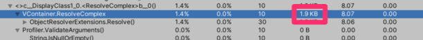

import {MyResponsiveBar} from './BenchmarkGraph';

<MyResponsiveBar />

**VContainer** is an DI (Dependency Injection) library running on Unity (Game Engine).

"V" means making Unity's initial "U" more thinner and solid ... !

- **Fast resolve:** Basically, 5-10x faster than Zenject.
- **Minimum GC allocation**: In Resolve, We have zero allocation without spawned instances.
- **Extra small code size**: Few internal types and few .callvirt.
- **Flexible scoping**: Application can freely create nested Lifetime Scope.
- **IoC**: Create script entry point without MonoBehaviour. (Using own Unity's PlayerLoopSystem)
- **ECS integration**
- **Immutable Container:** Thread safety and robustness.

Benchmarking:

- By default, both VContainer and Zenject use reflection at runtime.
- "VContainer (CodeGen)" means optimization feature by pre-generation IL code of Inject methods by ILPostProcessor.
    - See [Optimization](#optimization) section  more information.

An example of profile results for GC Alloc:

(VContainer has achieved zero allocation during Resolve.)

## What is DI ?

DI (Dependency Injection) is a general technique in OOP that all about removing unconcerned dependencies from your code.
It brings testability, maintainability, extensibility or any kind of exchangeability to your object graph.

In all programming paradigms, the basic design is, weak module coupling and strong module cohesion.
As you know, OOP(Object Oriented Programming) does it through objects.
1. Objects hides the details of its responsibility (encapsulation).
2. Objects transfer work outside their responsibilities to other objects

Actually, There is a problem in doing this fundamentally.
If you write the delegation object in the class code, it means tight coupling at the source code level.
The only way to exclude a unconcerned dependency from a class is to pass from outside.

Then, if your class receives dependencies externally, need help from outside.
DI is a technique that facilitates a place to resolve dependencies completely outside.

### Why DI for Unity ?

In Unity, MonoBehaviour is the entry point for our C # code.  On the other hand, MonoBehaviour is also a "View component".

In modern application design, "separation of domain logic and presentation layer (View component)" is important.

It is against this that MonoBehaviour has many roles (event handling, control flow, domain logic calls, etc.) in addition to its behavior as a View.

One of the purposes of DI is IoC (Inversion of Control).  DI containers we can make pure C # classes the entry point (not MonoBehaviour). This means that the control flow and other domain logic can be separated from the function of MonoBehaviour as a view component.

View components are dynamically created / destroyed at run time, while all "features" such as control flow and domain logic have a more stable lifespan.

Generally speaking, it's a good idea to make the View layer stateless and separate it from control flow and data management.

This is the main reason I like DI.

### Terminology

- **DI Container:** Have dependent references all at once and execute auto-wiring.
- **Composition Root:** The place where you make settings to resolve dependencies.
- **Auto-wiring:** It is a function that allows you to manage services in the container with minimal configuration. DI library usually does this.
- **IoC (Inversion of Control):** Make the object with control flow responsibility an entry point. In simple and traditional programming, the entry point is where the responsibility for interrupting user input is.

Note:
- Don't try to DI what an object should hide inside. What's hidden is leaking and the design is getting worse.
- The word DI does not necessarily mean magic or library. Creating your own Composition Root without using the library is called `Poor man's DI` or `DIY DI`.  This is **not** an anti-pattern.

Further reading:
- [Lightweight IoC Container for Unity - Seba's Lab](https://www.sebaslab.com/ioc-container-unity-part-1/)
- [Manning | Dependency Injection in .NET](https://www.manning.com/books/dependency-injection-in-dot-net)
