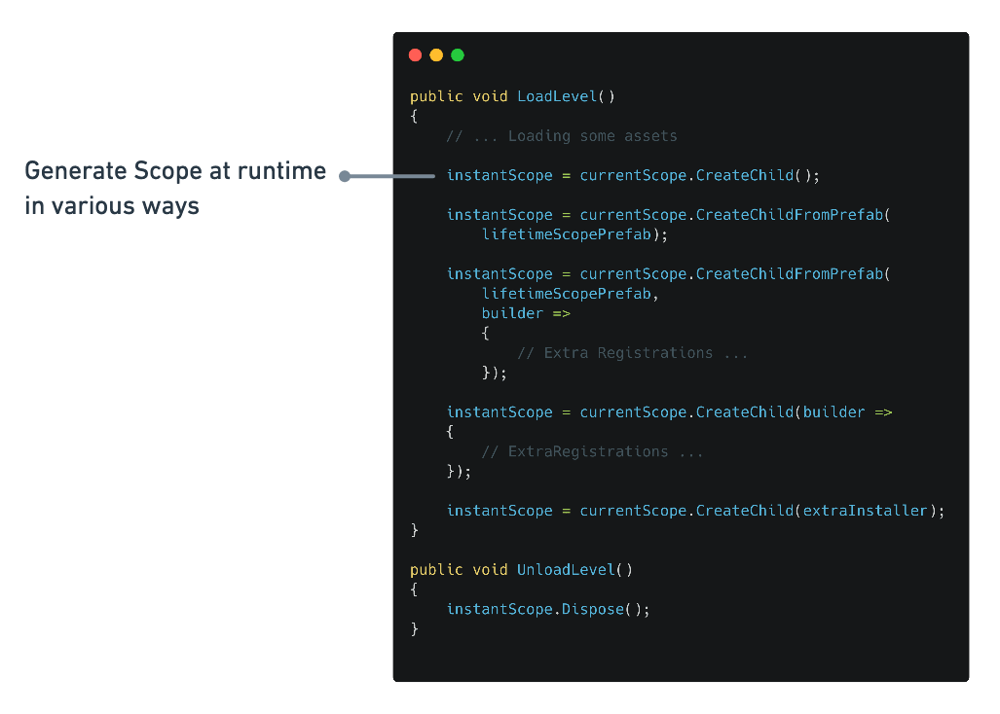

import Link from '@docusaurus/Link'
import {BenchmarkGraph} from "./BenchmarkGraph"

A fatest DI (Dependency Injection) for Unity. "V" means making Unity's initial "U" more thinner and solid.

- **Fast Resolve:** Basically 5-10x faster than Zenject. Pre IL Code generation optimization mode available.
- **Minimum overhead:** In Resolve, has **zero allocation** without spawned instances. Pay attention any overhead.
- **Assisting correct DI way:**: Provides simple and transparent API, and recommends a stable lifetime DI.
- **Flexible scoping**: Application can freely create nested Lifetime Scope.
- **Immutable Container:** Thread safety and robustness.

## DI + Inversion of Control for Unity

DI containers we can make pure C # classes the entry point (not MonoBehaviour). This means that the control flow and other domain logic can be separated from the function of MonoBehaviour as a view component.

## Performance

### Benchmark result 10,000 iteration for each test cases (Unity 2019.x / IL2CPP Standalone macOS)

<BenchmarkGraph height={260} />

- By default, both VContainer and Zenject use reflection at runtime.
- "VContainer (CodeGen)" means optimization feature by pre-generation IL code of Inject methods by ILPostProcessor. See [Optimization](../optimization/codegen) section  more information.

## Simple and transparent API

### Flexible Scoping with async

