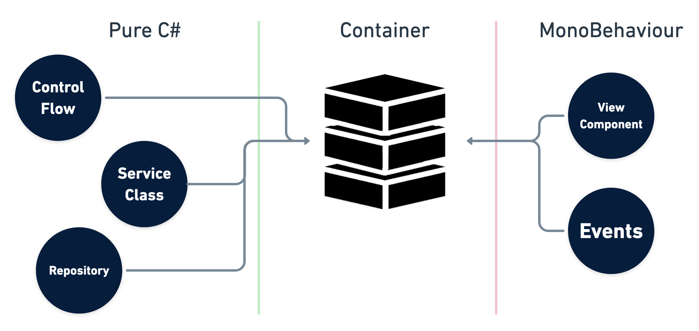

# VContainer

import {BenchmarkGraph} from "../../src/components/BenchmarkGraph"
import {GCAllocGraph} from "../../src/components/GCAllocGraph"

The extra fast DI (Dependency Injection) for Unity Game Engine. "V" means making Unity's initial "U" more thinner and solid..!

- **Fast Resolve:** Basically [5-10x faster](#performance) than Zenject.
- **Minimum GC Allocation:** In Resolve, we have **zero allocation** without spawned instances.
- **Small code size:** Few internal types and few .callvirt.
- **Assisting correct DI way:** Provides simple and transparent API, and carefully select features. This prevents the DI declaration from becoming overly complex.
- **Immutable Container:** Thread safety and robustness.

#### Features

- [Constructor Injection](../resolving/constructor-injection) / [Method Injection](../resolving/method-injection) / [Property & Field Injection](../resolving/property-field-injection)
- [Plain C# entry point on own PlayerLoopSystem](../integrations/entrypoint)
- [Flexible scoping](../scoping/lifetime-overview)
  - Application can freely create nested Lifetime Scope with any async way for you like.
- [Accelerated mode with Roslyn Source Generator](../optimization/source-generator)
- [Diagnostics Window](../diagnostics/diagnostics-window)
- [UniTask Integration](../integrations/unitask)
- [ECS Integration](../integrations/ecs) *beta*

## DI + Inversion of Control for Unity



DI containers we can make pure C # classes the entry point (not MonoBehaviour). This means that the control flow and other domain logic can be separated from the function of MonoBehaviour as a view component.

Further reading:
- [Manning | Dependency Injection in .NET](https://www.manning.com/books/dependency-injection-in-dot-net)
- [Lightweight IoC Container for Unity - Seba's Lab](https://www.sebaslab.com/ioc-container-unity-part-1/)

## Performance

### Benchmark result for 10,000 iterations for each test case (Unity 2019.x / IL2CPP Standalone macOS)

<BenchmarkGraph height={260} />

- By default, both VContainer and Zenject use reflection at runtime.
- "VContainer (CodeGen)" means optimization by pre-generating IL code of Inject methods by ILPostProcessor. See [Optimization](../optimization/codegen) section for more information.

### GC Alloc result in the Resolve Complex test case (Unity Editor profiled)

<GCAllocGraph height={260} />

## Basic Usage

First, create a scope. References are automatically resolved for types registered here.

```csharp
public class GameLifetimeScope : LifetimeScope
{
    protected override void Configure(IContainerBuilder builder)
    {
        builder.RegisterEntryPoint<ActorPresenter>();

        builder.Register<CharacterService>(Lifetime.Scoped);
        builder.Register<IRouteSearch, AStarRouteSearch>(Lifetime.Singleton);

        builder.RegisterComponentInHierarchy<ActorsView>();
    }
}
```

Where definitions of classes are

```csharp
public interface IRouteSearch
{
}

public class AStarRouteSearch : IRouteSearch
{
}

public class CharacterService
{
    readonly IRouteSearch routeSearch;

    public CharacterService(IRouteSearch routeSearch)
    {
        this.routeSearch = routeSearch;
    }
}
```

```csharp
public class ActorsView : MonoBehaviour
{
}
```

and

```csharp
public class ActorPresenter : IStartable
{
    readonly CharacterService service;
    readonly ActorsView actorsView;

    public ActorPresenter(
        CharacterService service,
        ActorsView actorsView)
    {
        this.service = service;
        this.actorsView = actorsView;
    }

    void IStartable.Start()
    {
        // Scheduled at Start () on VContainer's own PlayerLoopSystem.
    }
}
```

- In this example, the routeSearch of CharacterService is automatically set as the instance of AStarRouteSearch when CharacterService is resolved.
- Further, VContainer can have a Pure C# class as an entry point. (Various timings such as Start, Update, etc. can be specified.) This facilitates "separation of domain logic and presentation".

### Flexible Scoping with async

LifetimeScope can dynamically create children. This allows you to deal with the asynchronous resource loading that often occurs in games.

```csharp
public void LoadLevel()
{
    // ... Loading some assets

    // Create a child scope
    instantScope = currentScope.CreateChild();

    // Create a child scope with LifetimeScope prefab
    instantScope = currentScope.CreateChildFromPrefab(lifetimeScopePrefab);

    // Create a child with additional registration
    instantScope = currentScope.CreateChildFromPrefab(
        lifetimeScopePrefab,
        builder =>
        {
            // Extra Registrations ...
        });

    instantScope = currentScope.CreateChild(builder =>
    {
        // ExtraRegistrations ...
    });

    instantScope = currentScope.CreateChild(extraInstaller);
}

public void UnloadLevel()
{
    instantScope.Dispose();
}
```

In addition, you can create a parent-child relationship with LifetimeScope in an Additive scene.

```csharp
class SceneLoader
{
    readonly LifetimeScope currentScope;

    public SceneLoader(LifetimeScope currentScope)
    {
        currentScope = currentScope; // Inject the LifetimeScope to which this class belongs
    }

    IEnumerator LoadSceneAsync()
    {
        // LifetimeScope generated in this block will be parented by `this.lifetimeScope`
        using (LifetimeScope.EnqueueParent(currentScope))
        {
            // If this scene has a LifetimeScope, its parent will be `parent`.
            var loading = SceneManager.LoadSceneAsync("...", LoadSceneMode.Additive);
            while (!loading.isDone)
            {
                yield return null;
            }
        }
    }

    // UniTask example
    async UniTask LoadSceneAsync()
    {
        using (LifetimeScope.EnqueueParent(parent))
        {
            await SceneManager.LoadSceneAsync("...", LoadSceneMode.Additive);
        }
    }
}
```

```csharp
// LifetimeScopes generated during this block will be additionally Registered.
using (LifetimeScope.Enqueue(builder =>
{
    // Register for the next scene not yet loaded
    builder.RegisterInstance(extraInstance);
}))
{
    // Loading the scene..
}
```

See [scoping](../scoping/lifetime-overview) for more information.

## UniTask

```csharp
public class FooController : IAsyncStartable
{
    public async UniTask StartAsync(CancellationToken cancellation)
    {
        await LoadSomethingAsync(cancellation);
        await ...
        ...
    }
}
```

```csharp
builder.RegisterEntryPoint<FooController>();
```

See [integration](../integrations/unitask) for more information.

## Diagnostics Window


See [diagnostics](../diagnostics/diagnostics-window) for more information.

## Getting Started

- [Installation](../getting-started/installation)
- [Hello World](../getting-started/hello-world)
- [Comparing to Zenject](../comparing/comparing-to-zenject)
