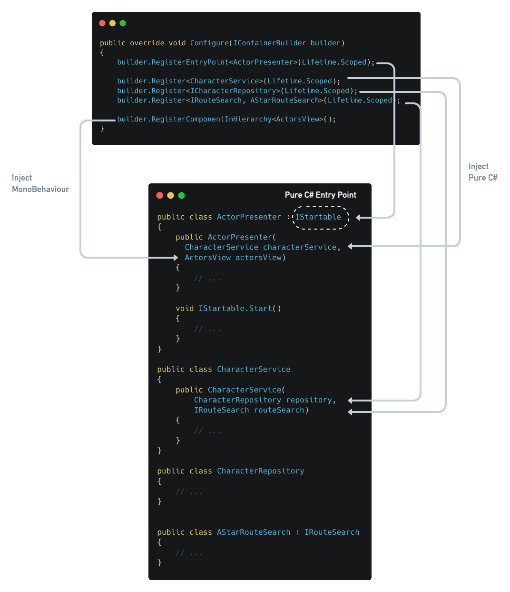
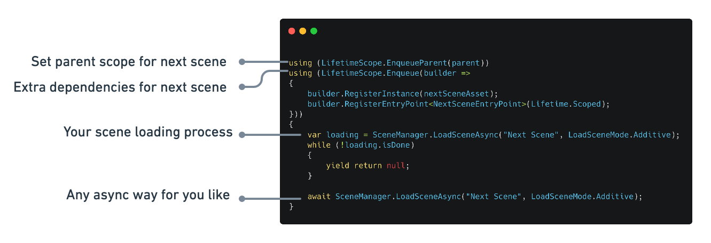
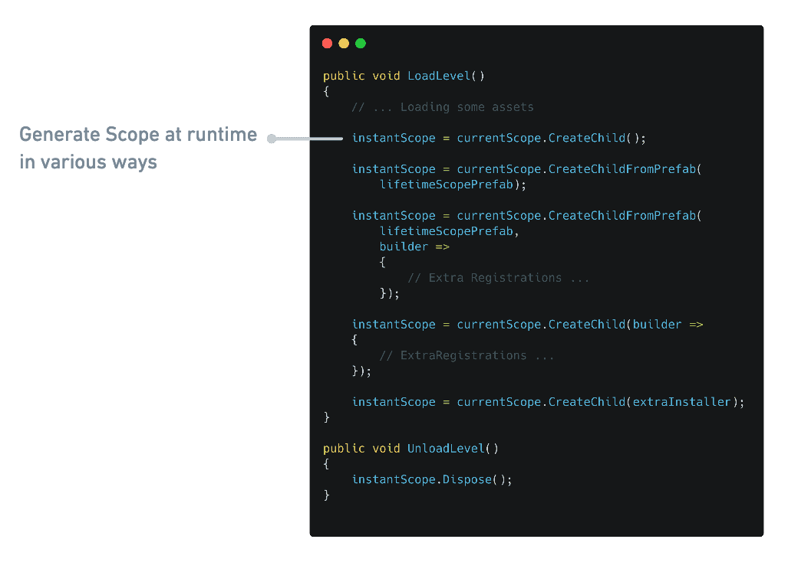

# VContainer

import Link from '@docusaurus/Link'
import {BenchmarkGraph} from "../components/BenchmarkGraph"
import {GCAllocGraph} from "../components/GCAllocGraph"

The extra fast DI (Dependency Injection) for Unity Game Engine. "V" means making Unity's initial "U" more thinner and solid..!

- **Fast Resolve:** Basically [5-10x faster](#performance) than Zenject.
- **Minimum GC Allocation:** In Resolve, we have **zero allocation** without spawned instances.
- **Small code size:** Few internal types and few .callvirt.
- **Assisting correct DI way:** Provides simple and transparent API, and carefully select features. This prevents the DI declaration from becoming overly complex.
- **Immutable Container:** Thread safety and robustness.

#### Features

- [Constructor Injection](../resolving/constructor-injection) / [Method Injection](../resolving/method-injection) / [Property & Field Injection](../resolving/property-field-injection)
- [Dispatch own PlayerLoopSystem](../integration/dispatching-unity-lifecycle-event)
- [Flexible scoping](../scoping/lifetime-overview)
  - Application can freely create nested Lifetime Scope with any async way for you like.
- [Pre IL Code generation optimization mode](../optimization/codegen)
- [ECS Integration](../integration/ecs) *beta*

## DI + Inversion of Control for Unity

DI containers we can make pure C # classes the entry point (not MonoBehaviour). This means that the control flow and other domain logic can be separated from the function of MonoBehaviour as a view component.

Further reading:
- [Manning | Dependency Injection in .NET](https://www.manning.com/books/dependency-injection-in-dot-net)
- [Lightweight IoC Container for Unity - Seba's Lab](https://www.sebaslab.com/ioc-container-unity-part-1/)

## Performance

### Benchmark result 10,000 iteration for each test cases (Unity 2019.x / IL2CPP Standalone macOS)

<BenchmarkGraph height={260} />

- By default, both VContainer and Zenject use reflection at runtime.
- "VContainer (CodeGen)" means optimization feature by pre-generation IL code of Inject methods by ILPostProcessor. See [Optimization](../optimization/codegen) section  more information.

### GC Alloc result int the Resolve Complex test case (Unity Editor profiled)

<GCAllocGraph height={260} />

## Simple and transparent API

### Flexible Scoping with async

## Getting Started

- [Installation](../getting-started/installation)
- [Hello World](../getting-started/hello-world)
- [Comparing to Zenject](../comparing/comparing-to-zenject)
