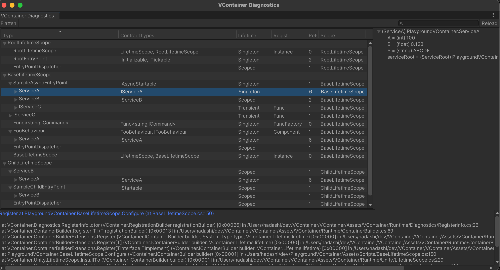

VContainer has an editor tool in Unity for debugging.

- In the middle pane, you can see the dependencies that VContainer has built.
    - Select any row detail in the center pane to see more details about Registration.
- In the lower pane, you can see where the selected row has been registered. By clicking on the blue link, you can open the corresponding part of the code.
- In the right pane, you can see the contents of the instance retrieved from the container for the type of the currently selected row.
    - This is the ToString() of the field/property. If you want a more meaningful value, you can consider overriding ToString().

To enable this, fllow the steps below:

- 1. Create `VContainerSettings`
    - Choose `Assets -> Create -> VContainer -> VContainer Settings`
- 2. From your VContainerSettings, check to the **Enable Diagnostics**.
    - 
- 3. Choose Window -> VContainer Diagnostics to open window as a screenshot

:::warning
"Enable Diagnostics" will significantly degrade performance; GC allocation will also be greatly increased.

It is recommended to enable it only during development.
:::

:::info
If you create VContainerSettings from this menu, it will be automatically registered in preload assets.

If VContainerSettings does not load, please make sure that VContainerSettings is included in the preload assets in Project Settings -> Player.
:::

## DiagnosticsInfo

When "Enable Diagnostics", containers are collecting debugging information internally.
You can also access this information through the following interface

- `DiagnosticsContext.GetDiagnosticsInfos()` returns list of debug information for all registered instances.
- `IObjectResolver.Diagnostics?.GetDiagnosticsInfos()` returns list of information for specific container.
