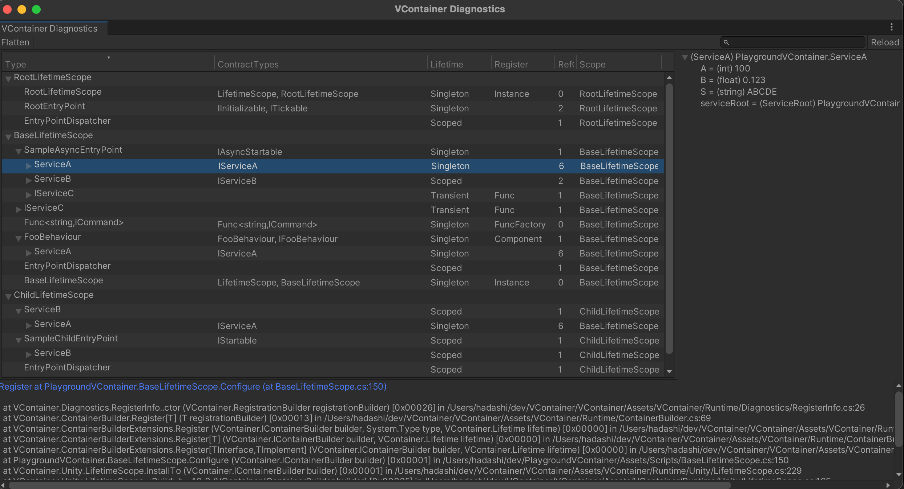
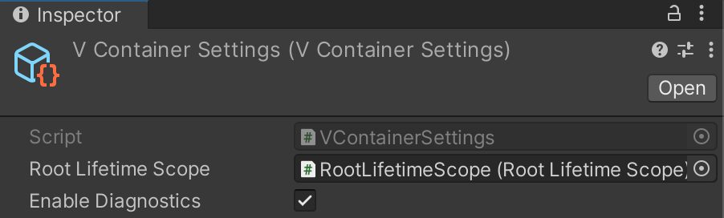

VContainer has an editor tool in Unity for viewing the object dependency graph.

- Middle pane shows the dependency tree view of objects registered in the DI container.
    - Select any row in the middle pane to see more details about Registration.
- Lower pane shows where the selected row has been registered. Click on the blue link to open the corresponding part of the code.
- Right pane shows the contents of the instance retrieved from the container for the type of the currently selected row.
    - This is a list of the instance's fields/properties' `ToString()` outputs. Consider overriding `ToString()` to display a more meaningful value.

To enable this feature, follow the steps below:

- 1. Create `VContainerSettings`.
    - Choose `Assets -> Create -> VContainer -> VContainer Settings` from the menu bar.
- 2. From your VContainerSettings, enable the **Enable Diagnostics** checkbox.
    - 
- 3. Choose `Window -> VContainer Diagnostics` to open window as shown in the screenshot above.

:::warning
"Enable Diagnostics" will significantly degrade performance; GC allocation will also be greatly increased.

It is recommended to enable this feature only during development.
:::

:::info
If you create VContainerSettings from this menu, it will be automatically registered in preload assets.

If VContainerSettings does not load, please make sure that VContainerSettings is included in the preload assets in Project Settings -> Player.
:::

## DiagnosticsInfo

When "Enable Diagnostics" is enabled, containers collect debugging information internally.
Access this information through the following interface:

- `DiagnosticsContext.GetDiagnosticsInfos()` returns a list of debug information for all registered instances.
- `IObjectResolver.Diagnostics?.GetDiagnosticsInfos()` returns a list of information for the specific container.
