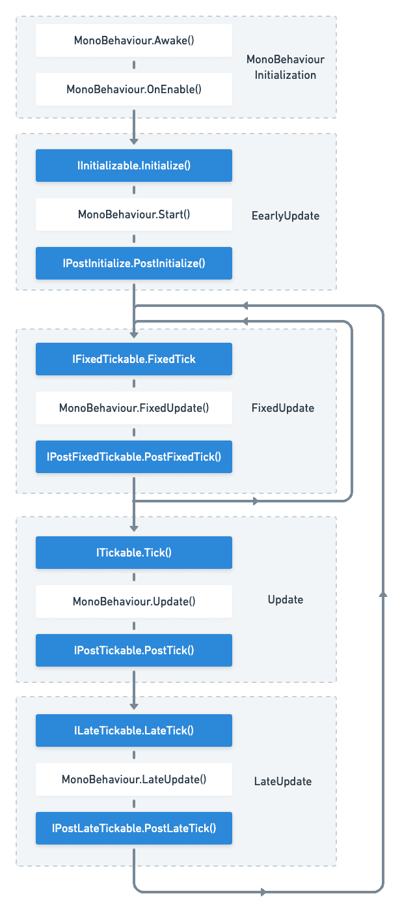

VContainer has own PlayerLoop sub systems.

If you register a class that implements the marker interface, it will be scheduled in Unity's PlayerLoop cycle.

Since it uses PlayerLoopSystem, it works even if you register at any time (e.g: `IInitilizable` etc)

The following interfaces and timings are available.

- `IInitializable`     : Nearly `Start`
- `IPostInitializable` : After `Start`
- `IFixedTickable`     : Nearly `FixedUpdate`
- `IPostFixedTickable` : After `FixedUpdate`
- `ITickable`          : Nearly `Update`
- `IPostTickable`      : After `Update`
- `ILateTickable`      : Nearly `LateUpdate`
- `IPostLateTickabl`   : After `LateUpdate`

And

- `IDisposable` : With container disposes. (For `Lifetime.Scoped`)

:::note
[Unity - Manual: Order of Execution for Event Functions](https://docs.unity3d.com/Manual/ExecutionOrder.html)
:::
