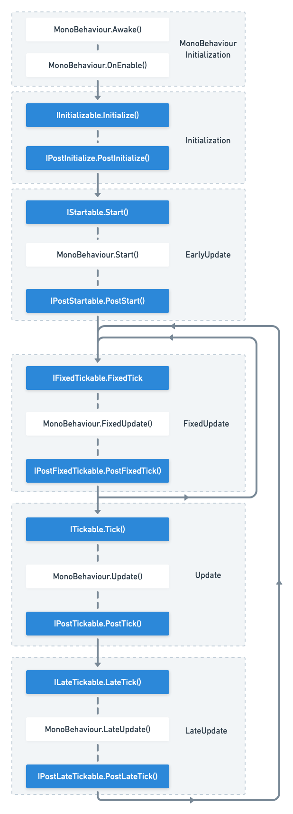

VContainer allows plain C# to be the starting point for application processing.
Using it instead of MonoBehaviour, which has a lot of features, can help you build a simple control flow.

```csharp
class FooController : IStartable
{
    void IStartable.Start()
    {
        // Do something ...
    }
}
```

```csharp
builder.RegisterEntryPoint<FooController>();
```

See [register](../registering/register-type#register-lifecycle-marker-interfaces)

VContainer does this with its own PlayerLoopSystem.

If you register a class that implements the marker interface, it will be scheduled in Unity's PlayerLoop cycle.

Since it uses PlayerLoopSystem, it works even if you register at any time (e.g: `IStartable` etc)


## Available interfaces

| VContainer entry point                | Timing |
|:--------------------------------------|:----------------------------------|
| `IInitializable.Initialize()`         | Immediately after building the container |
| `IPostInitializable.PostInitialize()` | Late `IInitializable.Initialize()`  |
| `IStartable.Start()`                  | Nearly `MonoBehaviour.Start()`    |
| `IPostStartable.PostStart()`          | After `MonoBehaviour.Start()`     |
| `IFixedTickable.FixedTick()`          | Nearly `MonoBehaviour.FixedUpdate()` |
| `IPostFixedTickable.PostFixedTick()`  | After `MonoBehaviour.FixedUpdate()` |
| `ITickable.Tick()`                    | Nearly `MonoBehaviour.Update()` |
| `IPostTickable.PostTick()`            | After `MonoBehaviour.Update()` |
| `ILateTickable.LateTick()`            | Nearly `MonoBehaviour.LateUpdate()` |
| `IPostLateTickable.LateTick()`        | After `MonoBehaviour.LateUpdate()` |

And

- `IDisposable` : With container disposes. (For `Lifetime.Singleton` / `Lifetime.Scoped`)



:::note
[Unity - Manual: Order of Execution for Event Functions](https://docs.unity3d.com/Manual/ExecutionOrder.html)
:::

## Handle of the exception that was not caught

On the application side, exceptions thrown in processes such as Start() and Tick() cannot be caught outside.

By default, VContainer logs unhandled exceptions as `UnityEngine.Debug.LogException`.
As another option, you can register a callback for each LifetimeScope.

```csharp
builder.RegisterEntryPointExceptionHandler(ex =>
{
    // ...
});
```

:::caution
Default error logging will be skipped if you are using the RegisterEntryPointExceptionHandler.
:::

## UniTask

If you are using UniTask, you can use `IAsyncStartable`. see also [UniTask Integration](../integrations/unitask)
