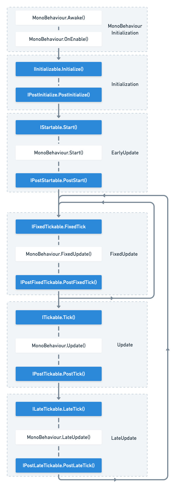

VContainer allows plain C# to be the starting point for application processing.
Using it instead of `MonoBehaviour`, which has a lot of features, can help you build a simple control flow.

```csharp
class FooController : IStartable
{
    void IStartable.Start()
    {
        // Do something ...
    }
}
```

```csharp
builder.RegisterEntryPoint<FooController>();
```

See [register](../registering/register-plain-csharp.mdx#register-lifecycle-marker-interfaces)

VContainer does this with its own PlayerLoopSystem.

If you register a class that implements the marker interface, it will be scheduled in Unity's PlayerLoop cycle.

Since it uses `PlayerLoopSystem`, it works even if you register at any time (e.g. `IStartable` etc).


## Available interfaces

| VContainer entry point                | Timing |
|:--------------------------------------|:----------------------------------|
| `IInitializable.Initialize()`         | Immediately after building the container |
| `IPostInitializable.PostInitialize()` | Late `IInitializable.Initialize()`  |
| `IStartable.Start()`                  | Nearly `MonoBehaviour.Start()`    |
| `IAsyncStartable.StartAsync()`        | Nearly `MonoBehaviour.Start()` (async) |
| `IPostStartable.PostStart()`          | After `MonoBehaviour.Start()`     |
| `IFixedTickable.FixedTick()`          | Nearly `MonoBehaviour.FixedUpdate()` |
| `IPostFixedTickable.PostFixedTick()`  | After `MonoBehaviour.FixedUpdate()` |
| `ITickable.Tick()`                    | Nearly `MonoBehaviour.Update()` |
| `IPostTickable.PostTick()`            | After `MonoBehaviour.Update()` |
| `ILateTickable.LateTick()`            | Nearly `MonoBehaviour.LateUpdate()` |
| `IPostLateTickable.PostLateTick()`        | After `MonoBehaviour.LateUpdate()` |

And:

- `IDisposable` : Disposed with the container. (For `Lifetime.Singleton` / `Lifetime.Scoped`)



:::note
[Unity - Manual: Order of Execution for Event Functions](https://docs.unity3d.com/Manual/ExecutionOrder.html)
:::

### async

`IAsyncStartable` is available as a variant of IStartable.
It has the same timing as IStartable, but `async Awaitable StartAsync()` is available.

The return type `Awaitable` differs depending on the environment:

| Condition | Return Type | Note |
| :--- | :--- | :--- |
| `VCONTAINER_UNITASK_INTEGRATION` enabled | `Cysharp.Threading.Tasks.UniTask` | Recommended if you use UniTask. |
| Unity 2023.1 or newer | `UnityEngine.Awaitable` | Uses Unity's built-in Awaitable. |
| Others | `System.Threading.Tasks.Task` | |

:::caution
If `VCONTAINER_UNITASK_INTEGRATION` is **disabled** and you are using **Unity 2020 or older**, `IAsyncStartable` will **not** be executed (it is ignored by VContainer's loop). To use `IAsyncStartable` in older Unity versions, you must install UniTask.
:::

If you are a UniTask user, you can also choose the UniTask version of `StartAsync`.
[UniTask integration](../integrations/unitask.mdx)

## Handling Uncaught Exceptions

On the application side, exceptions thrown in processes such as `Start()` and `Tick()` cannot be caught from the outside.

By default, VContainer logs unhandled exceptions as `UnityEngine.Debug.LogException`.
As another option, you can register a callback for each LifetimeScope.

```csharp
builder.RegisterEntryPointExceptionHandler(ex =>
{
    // ...
});
```

:::caution
Default error logging will be skipped if you are using the RegisterEntryPointExceptionHandler.
:::

## Multiple Independent Systems

VContainer's entry points are designed to be composable. If you have multiple independent systems (e.g., an InputSystem, a GameLoop, a NetworkManager), you should create separate classes implementing the necessary lifecycle interfaces (`IStartable`, `ITickable`, etc.) for each system and register them as entry points.

```csharp
public class InputSystem : IStartable, ITickable
{
    public void Start() { /* Initialize input */ }
    public void Tick() { /* Update input state */ }
}

public class GameLoop : IStartable
{
    readonly InputSystem input;
    public GameLoop(InputSystem input) { this.input = input; }

    public void Start() { /* Start game */ }
}
```

```csharp
// Register multiple entry points
builder.RegisterEntryPoint<InputSystem>();
builder.RegisterEntryPoint<GameLoop>();
```

VContainer will automatically collect all registered entry points and execute them.

You can also use `UseEntryPoints` to group registrations, which helps organize your configuration code.

```csharp
builder.UseEntryPoints(entryPoints =>
{
    entryPoints.Add<InputSystem>();
    entryPoints.Add<GameLoop>();
});
```
