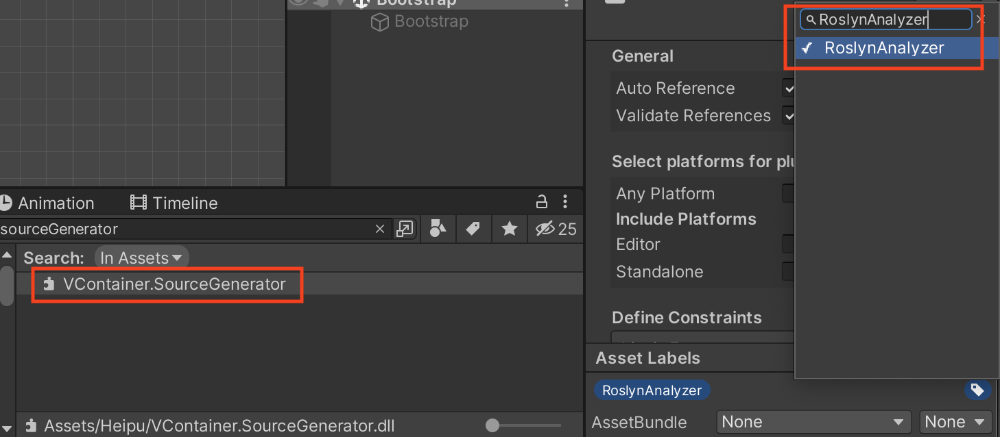

:::caution
This feature requires Unity 2021.3 or later.
:::

VContainer uses reflection for metaprogramming by default.
However, there is an option to improve execution performance by replacing it with [Roslyn Source Generator](https://learn.microsoft.com/en-us/dotnet/csharp/roslyn-sdk/source-generators-overview).

Source Generator is part of Roslyn's functionality as a C# compiler tool.
It is a feature that allows additional source code to be plugged in without contaminating the human-written source code.
Since the added code is in C#, it is more debuggable and maintainable than IL code generation or ExpressionTee at runtime.
While there are programming languages out there that have mechanisms such as "macros" built into their syntax, Source Generator has one thing in common in that it generates source code at compile time.
This is a standard meta-programming approach in the new .NET environment.

:::info
In the old version of VContainer, this feature was used by IL weaving using `Mono.Cecil`.
Since VContainer 1.13.0, we have moved to Roslyn Source Generator.
:::

## How to enable VContainer Source Generator

### 1. Add `VContainer.SourceGenerator.dll` to your project.

Download `VContainer.SourceGenerator.dll from the release page.
https://github.com/hadashiA/VContainer/releases

And Add this to somewhere under Assets/ folder in your project.

### 2. Mark as `RoslynAnalyzer`

Select `VcContainer.SourceGenerator.dll` in project.
And, click label icon in bottom of the inspector window.
Enter “RoslynAnalyzer” into the text input window in the Asset Labels sub-menu.



Then, from the inspector, do the following:
- Go to Select platforms for plugin and disable Any Platform.
- Go to Include Platforms and disable Editor and Standalone.

See more information:
- https://docs.unity3d.com/Manual/roslyn-analyzers.html

## Which classes are target to code generation?

By default, classes in the assembly that reference VContainer.asmdef are target to code generation.

If you want to exclude a target for reasons such as wanting to suppress unnecessary code generation, please add the [InjectIgnore] attribute to the type.


### Limitation

SourceGenerator acceleration is not supported for type definitions like the following. (works by reflection)

- Nested classes
- Struct
- If the access level is less than internal (for example, private), even if `[Inject]` is added, SourceGenerator is not supported.

## Remarks

With VContainer, for example, the following code (as IL) is automatically generated:

```csharp
class ClassA
{
    private sealed class __GeneratedInjector : IInjector
    {
        public object CreateInstance(IObjectResolver resolver, IReadOnlyList<IInjectParameter> parameters)
        {
            I6 fromConstructor = resolver.ResolveOrParameter<I6>("fromConstructor1", parameters);
            I7 fromConstructor2 = resolver.ResolveOrParameter<I7>("fromConstructor2", parameters);
            return new ClassA(fromConstructor, fromConstructor2);
        }

        public void Inject(object instance, IObjectResolver resolver, IReadOnlyList<IInjectParameter> parameters)
        {
            ClassA clasA = (ClassA)instance;
            I3 service = resolver.ResolveOrParameter<I3>("service3", parameters);
            I4 service2 = resolver.ResolveOrParameter<I4>("service4", parameters);
            allInjectionFeatureService.MethodInjectable1(service, service2);
            I5 service3 = resolver.ResolveOrParameter<I5>("service5", parameters);
            I6 service4 = resolver.ResolveOrParameter<I6>("service6", parameters);
            classA.MethodInjectable2(service3, service4);
            classA.PrivatePropertyInjectable = resolver.Resolve<I2>();
            classA.PublicPropertyInjectable = resolver.Resolve<I3>();
            classA.privateFieldInjectable = resolver.Resolve<I4>();
            classA.PublicFieldInjectable = resolver.Resolve<I5>();
        }
   }
```
