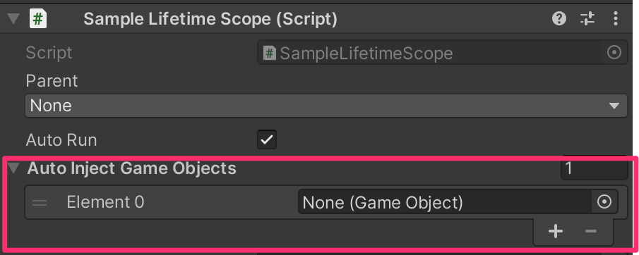

As `MonoBehaviour`s [do not support constructors](https://docs.unity3d.com/ScriptReference/MonoBehaviour.Awake), you must use [method injection](./method-injection) to inject them with dependencies.

Note that the presence of the `[Inject]` attribute on a `MonoBehaviour`'s method **does not** imply that it will automatically be called. You must inject dependencies manually in one of the following three ways:

1. If you want to inject into a specific `MonoBehaviour`, you can specify it in the `LifetimeScope`'s inspector.
    - The `MonoBehaviour`s of all specified `GameObject` (and their children) will be automatically `Inject`ed when the `LifetimeScope` is initialized. 
2. Use one of the `RegisterComponent*` methods to register the `MonoBehaviour` instance to the container.
    - In this case, the registered `MonoBehaviour` will both `Inject` and be `Inject`ed into other classes.
    - See [Register MonoBehaviour](../registering/register-monobehaviour)
3. To inject into dynamically-generated `MonoBehaviour`s at runtime (e.g. from prefabs), use `IObjectResolver.Instantiate` instead of [`UnityEngine.Object.Instantiate`](https://docs.unity3d.com/ScriptReference/Object.Instantiate). (Factory patterns and object generation expressions can be registered.)
    - See [Register Callbacks](../registering/register-callbacks)
    - See [Register Factory](../registering/register-factory)

## Why doesn't VContainer automatically inject into all `MonoBehaviour`s?

- Unity doesn't provide a good way to listen for the creation of all `GameObject`s or `MonoBehaviour`s. Rather than having some cases that are automatically `Inject`ed and some that are not, we decided on explicit `Inject`ion that you can use to fit your own needs.
- We do not recommend excecuting `Inject` directly on `MonoBehaviour`s; instead, use `InjectGameObject` on the owning `GameObject`.
  - `MonoBehaviour` is a C# class that allows you to write code for anything, also, it is dynamically created/destroyed at runtime. Injection into an object with a dynamic lifetime complicates reference management. The simplest solution to this is to not do it.
  - This is because the purpose of VContainer and DI is inversion of control of MonoBehaviour.
      - View component is often the starting point for detecting events and happenings, but it can also be styled to notify the outside world that it has ownership of the events it detects.
  - If a `MonoBehaviour` needs an explicit `Inject` call, you risk losing the advantages of Unity's prefab portability.
  - Of course, in order for the View component to work, it needs to know the data/state to be displayed on the screen, but data that changes rapidly at runtime is not subject to injection by `[Inject]`, and is better handled as mere "values" by arguments.

