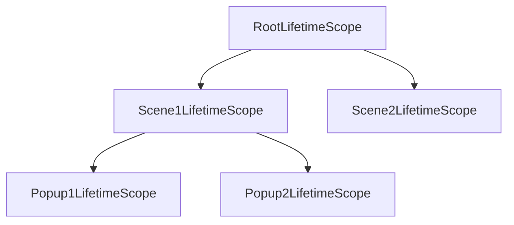

This page provides a concrete example of how `Singleton`, `Scoped`, and `Transient` lifetimes behave in a hierarchical scope structure.

## Scenario: LifetimeScope Hierarchy

Suppose you have the following `LifetimeScope` structure:



And a simple service with a unique ID:

```csharp
public class MyService
{
    public Guid Id { get; } = Guid.NewGuid();
}
```

---

## 1. Singleton Registration

If `MyService` is registered as **Singleton** in the Root scope:

```csharp
// RootLifetimeScope.cs
builder.Register<MyService>(Lifetime.Singleton);
```

| Scope | MyService Instance (Id) | Note |
| :--- | :--- | :--- |
| **Root** | **A** | Created in Root |
| Scene1 | **A** | Shared from Root |
| Popup1 | **A** | Shared from Root |
| Popup2 | **A** | Shared from Root |
| Scene2 | **A** | Shared from Root |

**Behavior:** All scopes share the same instance (A). `Singleton` creates one instance per registration, shared across the hierarchy.

---

## 2. Scoped Registration (in Root only)

If `MyService` is registered as **Scoped** in the Root scope:

```csharp
// RootLifetimeScope.cs
builder.Register<MyService>(Lifetime.Scoped);
```

| Scope | MyService Instance (Id) | Note |
| :--- | :--- | :--- |
| **Root** | **A** | Created in Root |
| Scene1 | **B** | Created in Scene1 |
| Popup1 | **C** | Created in Popup1 |
| Popup2 | **D** | Created in Popup2 |
| Scene2 | **E** | Created in Scene2 |

**Behavior:**
- `Lifetime.Scoped` means "One instance per `LifetimeScope`".
- Even if registered in the Root, when a child scope (e.g., Scene1) resolves it, a **new instance** (B) is created and cached specifically for that child scope.
- Descendants (Popup1) also create their own instances (C) because they are separate scopes resolving a Scoped registration.

:::note
If you want to share an instance across a specific subtree (e.g., Scene1 and its children), you should use **Singleton** registration within Scene1, or use `RegisterInstance` to pass a specific instance.
:::

---

## 3. Scoped Registration (in Popup1 as well)

If `MyService` is registered as **Scoped** in Root, AND also in Popup1:

```csharp
// RootLifetimeScope.cs
builder.Register<MyService>(Lifetime.Scoped);

// Popup1LifetimeScope.cs
builder.Register<MyService>(Lifetime.Scoped);
```

| Scope | MyService Instance (Id) | Note |
| :--- | :--- | :--- |
| **Root** | **A** | Created in Root |
| Scene1 | **B** | Created in Scene1 |
| Popup1 | **F** | Created in Popup1 (overridden) |
| Popup2 | **D** | Created in Popup2 (uses Root registration) |
| Scene2 | **E** | Created in Scene2 |

**Behavior:**
- Popup1 registers its own `MyService`, so it uses that registration. Since it is Scoped, it creates instance F.
- Popup2 does not have its own registration, so it uses the Root registration. Since it is Scoped, it creates instance D (separate from Scene1's instance).

---

## 4. Transient Registration (in Root)

If `MyService` is registered as **Transient** in the Root scope:

```csharp
// RootLifetimeScope.cs
builder.Register<MyService>(Lifetime.Transient);
```

| Scope | MyService Instance (Id) |
| :--- | :--- |
| Root | **G** (new every resolve) |
| Scene1 | **H** (new every resolve) |
| Popup1 | **I** (new every resolve) |
| Popup2 | **J** (new every resolve) |
| Scene2 | **K** (new every resolve) |

**Behavior:** Every time the service is resolved, a new instance is created, regardless of the scope.

---

## Summary Table

| Lifetime | Instance Sharing Behavior |
| :--- | :--- |
| **Singleton** | One instance per registration. Shared across the hierarchy (Root and all descendants). |
| **Scoped** | One instance per `LifetimeScope`. Each scope (Parent, Child, etc.) gets its own unique instance when resolving. |
| **Transient** | New instance every time the service is resolved. |
