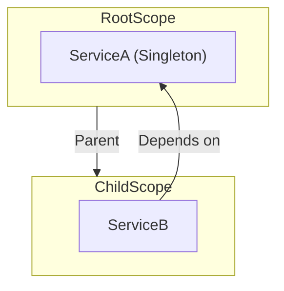

- Singleton : Single instance for all containers.
  - Same type cannot be registered in the same container.
- Transient : Instance per resolution.
- Scoped    : Instance per `LifetimeScope`.
  - If `LifetimeScope` is single, similar to Singleton.
  - If you create a `LifetimeScope` child, the instance will be different for each child.
  - When `LifetimeScope` is destroyed, its references are released and it calls all the registered `IDisposable`.

## Lifetime with Parent/Child relationship

`LifetimeScope` supports a hierarchical parent-child relationship. This structure determines how dependencies are resolved and how their lifecycles are managed.

### Resolution Logic

When you request a dependency from a `LifetimeScope`:
1. It checks if the type is registered within itself.
2. If found, it resolves using its own registration.
3. If not found, it delegates the request to its **Parent**.
4. This continues up the chain until the root.
5. If not found anywhere, resolution fails.

This means **registrations in a Child scope override registrations in the Parent scope**.

### Lifetime Behavior in Hierarchy

See [Instance Sharing Example](./instance-sharing-example.mdx) for a concrete example.

- **Singleton (`Lifetime.Singleton`)**
  - **Behavior:** Shared across the hierarchy starting from the registration scope.
  - **Resolution:** If registered in the Parent, all Children share that single Parent instance. If registered in the Child, that Child gets its own Singleton (shadowing the Parent's if present).
  - **Disposal:** Disposed when the `LifetimeScope` that owns it is destroyed.

- **Scoped (`Lifetime.Scoped`)**
  - **Behavior:** One instance per `LifetimeScope`.
  - **Resolution:** Each `LifetimeScope` (Parent, Child, etc.) that resolves the service will create and cache its **own unique instance**.
    - Even if the service is registered in the Parent, resolving it in the Child creates a new instance specific to the Child scope.
    - If you want to share an instance across a hierarchy, consider using `Lifetime.Singleton` or `RegisterInstance`.
  - **Disposal:** Disposed when its owning `LifetimeScope` is destroyed.

- **Transient (`Lifetime.Transient`)**
  - **Behavior:** A new instance is created every time it is requested.
  - **Resolution:** It doesn't matter where it is registered; a new instance is created on demand.
  - **Disposal:** VContainer does **not** track Transient objects for disposal. They are not automatically disposed. You must manage their lifecycle manually if they implement `IDisposable`.

:::warning Transient and IDisposable
Objects registered as `Lifetime.Transient` are **not** automatically disposed by VContainer. If your transient objects implement `IDisposable`, you are responsible for calling `Dispose()`.
:::

:::caution
If the scene is alive and only `LifetimeScope` is destroyed, MonoBehaviours registered as `Lifetime.Scoped` are not automatically destroyed.
If you want to destroy them with `LifetimeScope`, make them a child transform of `LifetimeScope` or consider implementing `IDisposable`.
:::
