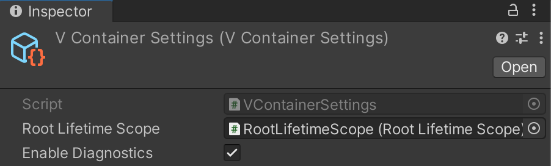

オブジェクトの依存グラフを確認するための、Unityのエディタツールが同梱されています。

- 真ん中のペインでは、DIコンテナに登録されたオブジェクトの依存ツリーを確認することができます。
    - ここで特定の行を選択すると、該当のRegistrationについて詳細が他のペインに表示されます。
- 下のペインでは、選択された行について `Register*` が行われたコードの場所を確認できます。青いリンクテキストをクリックすると、該当のファイルを開くことができます。
- 右ペインでは、選択された行について、コンテナから取り出されたインスタンスの詳細を確認できます。
    - これはインスタンスの プロパティ/フィールドの `ToString()` のリストです。ここにより意味のある情報を表示する方法のひとつは、ToString()のオーバライドすることです。

この機能を有効にするには:

- 1. `VContainerSettings` を作成します。
    - ツールバーから `Assets -> Create -> VContainer -> VContainer Settings`
- 2. VContainerSettings のインスペクタから、 **Enable Diagnostics** のチェックを有効にします。
    - 
- 3. `Window -> VContainer Diagnostics` を選択すると、上のスクリーンショットのようなウインドウが開きます。

:::danger
"Enable Diagnostics" が有効の場合、パフォーマンスが著しく低下します。(GCアロケーションも増加します)。この機能は開発中のみ有効にすることをおすすめします。
:::

:::info
VContainerSettings を作成すると、自動的に プロジェクトの Preload Assets に登録されます。

VContainerSettingsが読み込まれない場合、Project Settings の Player セクションにある Preload Assets に VContainerSettingsが含まれているか確認して下さい。
:::

## DiagnosticsInfo

"Enable Diagnostics" が有効のとき、内部的にデバッグ情報の収集が行わています。
このデータを直接使用するための以下のようなインターフェイスも公開されています。

- `DiagnosticsContext.GetDiagnosticsInfos()` returns list of debug information for all registered instances.
- `IObjectResolver.Diagnostics?.GetDiagnosticsInfos()` returns list of information for specific container.
