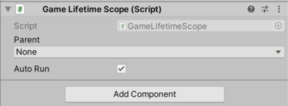

VContainerの基本的な使い方は以下です。

- `LifetimeScope` を継承したコンポーネントを作り、シーンに置きます。これが1つのコンテナ(1つのスコープ)を表現します。
- LifetimeScopeのメソッドをオーバライドして、依存関係を管理したいオブジェクトを登録していきます。(これがいわゆる Composition Root)
- シーンをプレイすると、`LifetimeScope` は自動的にコンテナをつくり、独自の Player Loop System のスケジュールを始めます。

:::note
通常、スコープは ゲーム実行中に 何度も生成/破棄されることがあります。 `LifetimeScope` はこれを想定しており、動的な生成や、親子関係をつくる機能も持っています。
:::

**1. 他オブジェクトへ機能を委譲するクラスをつくる**

一例として、「Hello World」って言うだけのサービスクラスをつくってみよう。

```csharp title="HelloWorldService.cs"
namespace MyGame
{
    public class HelloWorldService
    {
        public void Hello()
        {
            UnityEngine.Debug.Log("Hello world");
        }
    }
}
```


**2. DIの設定を施す(Composition Root)**

さきほどの何の変哲もないクラスをDIコンテナに登録すると、必要な箇所へ自動的に参照関係をつくることができるようになります。(Auto-Wiring)

コンテナをつくるため、LifetimeScope を継承したコンポーネントを作成しましょう。

- Projectウインドウの右クリックメニュー、`Create -> C# Script` から、新しいMonoBehaviourクラス定義ファイルを作成します。
- ここでは `GameLifetimeScope.cs` という名前をつけます。

:::note
VContainer は、名前が「LifetimeScope」で終わる C# スクリプトのファイルに対して自動的にテンプレートを適用します。
:::

作成したクラスの中の `Configure` メソッドをオーバライドして、DIの設定を行います。

```diff title="GameLifetimeScope.cs"
using VContainer;
using VContainer.Unity;

namespace MyGame
{
    public class GameLifetimeScope : LifetimeScope
    {
        protected override void Configure(IContainerBuilder builder)
        {
+            builder.Register<HelloWorldService>(Lifetime.Singleton);
        }
    }
}
```

:::note
VContainer では上記のようなクラス登録時、`Lifetime` を明示的に引数で指定するようになっています。

Lifetimeについて詳しくは [Lifetime Overview](/scoping/lifetime-overview) を参照して下さい。
:::

**3. 作成したLifetimeScopeをGameObjectにアタッチ**

LifetimeScopeをシーンに配置します。ヒエラルキウインドウの右クリックメニューから 「Create Empty」でGameObjectをつくり、名前は `GameLifetimeScope` にしておきましょう。
前の工程でつくった `GameLifetimeScope` をここにアタッチします。



**4. HelloWorldService を呼び出すには**

`builder` を使用して登録したクラスたちは、自動的に参照関係が構築されます。

たとえば以下のように、`HelloWorldService` へ仕事を委譲するクラスも追加しましょう。

```csharp title="GamePresenter.cs"
using VContainer;
using VContainer.Unity;

namespace MyGame
{
    public class GamePresenter
    {
        readonly HelloWorldService helloWorldService;

        public GamePresenter(HelloWorldService helloWorldService)
        {
            this.helloWorldService = helloWorldService;
        }
    }
}
```

このクラスは、コンストラクタで `HelloWorldService` を引数にとっています。DIコンテナは、このような定義をみつけて、自動的に必要なオブジェクトをコンストラクタに渡してくれます。

このクラスもDIコンテナへ登録してみましょう。

```diff
builder.Register<HelloWorldService>(Lifetime.Singleton);
+ builder.Register<GamePresenter>(Lifetime.Singleton);
```

**5. 独自の C#クラスを Unityの PlayerLoopSystem上で走らせる**

Unityでアプリケーションとかゲームを書くには、Unityのライフサイクルイベント上でコードを実行しなければいけないはずです。
通常は MonoBehaviour の `Start` / `Update` / `OnDestroy` などを使用することになりますが、このような処理の起点のことを、VContainerでは 「EntryPoint」と呼んでいます。

VContainerでは、特別なInterfaceを実装したクラスを登録しておくことで、MonoBehaviourを使用せずに EntryPointをつくることができます。

上記で定義した GamePresenter を EntryPoint にしてみましょう。

```diff title="GamePresenter.cs"
using VContainer;
using VContainer.Unity;

 namespace MyGame
 {
-    public class GamePresenter
+    public class GamePresenter : ITickable
     {
         readonly HelloWorldService helloWorldService;

         public GamePresenter(HelloWorldService helloWorldService)
         {
             this.helloWorldService = helloWorldService;
         }

+        void ITickable.Tick()
+        {
+            helloWorldService.Hello();
+        }
     }
 }
```

この変更で、UnityのUpdateのタイミングで、 `ITickable.Tick()` メソッドが自動的に呼ばれるようにしています。

基本的には、副作用の実行の開始はコンストラクタではなく EntryPointを介して行うのが良いでしょう。

:::note
MonoBehaviourに関して言えば、`Start` や `Update` などを使えばおそらく十分です。VContainerのEntryPointは、ドメインロジックとプレゼンテーションロジックを分離するために役に立ちます。
:::

さて、以上を実際にUnityのライフサイクルイベントで動作させるには、`RegisterEntryPoint` メソッドで登録しておく必要があることに注意して下さい。

```diff title="GameLifetimeScope.cs"
- builder.Register<GamePresenter>(Lifetime.Singleton);
+ builder.RegisterEntryPoint<GamePresenter>();
```

:::tip
たくさんの EntryPoint を登録したいときは、以下のように一箇所にまとめて書く記法が用意されています。

```csharp title="GameLifetimeScope.cs"
builder.UseEntryPoints(Lifetime.Singleton, entryPoints =>
{
    entryPoints.Add<GamePresenter>();
    // entryPoints.Add<OtherSingletonEntryPointA>();
    // entryPoints.Add<OtherSingletonEntryPointB>();
    // entryPoints.Add<OtherSingletonEntryPointC>();
})
```

EntryPoint は設計上、特別な場所ですので、目立つようになっていると良いでしょう。
:::

**6. 制御の反転 (IoC = Inversion Of Control)**

ユーザの入力を受けて、まわりまわってなにかのロジックが実行されることを考えてみます。

たとえば以下のような Viewコンポーネントがあるとします。

```csharp title="HelloScreen.cs"
public class HelloScreen : MonoBehaviour
{
    public Button HelloButton;
}
```

Unity では、ここでの HelloScreen のような入力を受けつけるクラスに、直接 、入力を受けた後の処理を書いてしまうこともできるわけですが、アプリケーションの設計においてはそららを分離することが大事です。
「どんな入力に反応するか」、「なにを実行するか」、「どこへ出力するか」、これらがそれぞれフレキシブルに組み合わせられるようになっていると、色々な場面で自然にパーツの使い回しがききます。

やり方はいくつか考えられますが、ここでは 制御フローを司る専用のEntryPointをつくり、必要なオブジェクトを注入していきます。

このようにすると、`HelloScreen` に対して何かを注入したり、`HelloScreen` が直接誰かを呼び出したりするコードが一切必要ありません。 `HelloScreen` はどこのシーンで使うこともでき、より独立しています。


```diff  title="GamePresenter.cs"
namespace MyGame
{
-    public class GamePresenter : ITickable
+    public class GamePresenter : IStartable
     {
         readonly HelloWorldService helloWorldService;
+        readonly HelloScreen helloScreen;  

         public GamePresenter(
             HelloWorldService helloWorldService,
+            HelloScreen helloScreen)
         {
             this.helloWorldService = helloWorldService;
+            this.helloScreen = helloScreen;
         }

+        void IStartable.Start()
+        {
+            helloScreen.HelloButton.onClick.AddListener(() => helloWorldService.Hello());
+        }
     }    
}
```

入力を受けとる `HelloScreen` の方ではなく、制御フロー専門のクラスがロジックを呼び出すようにできました。 つまりこれが制御の反転ってわけです。

GamePresenter へ HelloScreen を注入したいので、DIの設定を忘れず追加しておきます。

```diff  title="GameLifetimeScope.cs"
    public class GameLifetimeScope : LifetimeScope
    {
+       [SerializeField]
+       HelloScreen helloScreen;

        protected override void Configure(IContainerBuilder builder)
        {
            builder.RegisterEntryPoint<GamePresenter>();
            builder.Register<HelloWorldService>(Lifetime.Singleton);
+           builder.RegisterComponent(helloScreen);
        }
    }
```

- **GamePresenter:** は、制御フローのみに責任をもちます。どの入力に反応してなにを実行すべきかをつなぎ合わせます。
- **HelloWorldService:** は、Hello World って出力することそれだけに責任を持ちます。
- **HelloScreen**: は、Viewコンポーネントです。画面に表示する内容だけに責任を持ちます。

ドメインロジック / 制御フロー / Viewコンポーネント をそれぞれ分割し、PresenterへのDIによって参照関係をつなげることができました。一般にこういうコンセプトは MVP(Model-View-Presenter) と呼ばれています。

