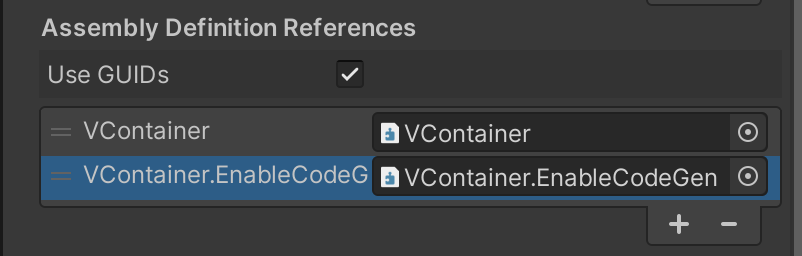

:::caution
This feature requires Unity 2021.3 or later.
:::

VContainerはデフォルトではリフレクションを用いてメタプログラミングを行ないますが、
[Roslyn Source Generator](https://learn.microsoft.com/en-us/dotnet/csharp/roslyn-sdk/source-generators-overview) に置き換えることで、実行速度を改善する機能が用意されています。

Source Generator は、C#コンパイラツールであるRoslynの機能の一部です。人間の書いたソースコードを汚すことなく追加のソースコードを差し込むことができる機能です。
追加されるコードはC#であるため、ILコード生成や実行時のExpressionTeeと比較してデバッグやメンテナンス性が高くなっています。
世の中には、マクロなどの仕組みがシンタックスに組み込まれているプログラミング言語がありますが、Source Generator はソースコードをコンパイル時に生成するという点で、共通点があります。
これは新しい.NET環境におけるメタプログラミングの標準的な手法と言えます。

:::info
以前のバージョンのVContainerは、`Mono.Cecil` を用いたコンパイル時ILコード生成で同様のことを実現していましたが、
VContainer 1.13.0 以降で、これをRoslyn Source Generatorに移行しました。
:::

## Source Generator を有効にする

以下は、VContainerのSourceGeneratorモードを有効にする手順です。

### 1. `VContainer.SourceGenerator.dll` をプロジェクトに追加

VContainerのリリースページから 、`VContainer.SourceGenerator.dll をダウンロードします。
https://github.com/hadashiA/VContainer/releases

VContainerがインストールされているUnityプロジェクトの Assets/ 以下の任意の場所にダウンロードしたdllを追加します。

### 2. `RoslynAnalizer` タグを付与

Unityのプロジェクトビューで、 `VcContainer.SourceGenerator.dll` を選択します。
インスペクターの下の方にあるラベルアイコンをクリックし、入力覧に “RoslynAnalyzer” と入力します。
RoslynAnalyzer というasset labelを付与することで、UnityはこのdllをAnalyzer or SourceGenerator として認識してくれます。



参考:
- https://docs.unity3d.com/Manual/roslyn-analyzers.html

この状態でコンパイルを走らせると、VContaienrは自動的にDIのための高速なコードを生成するようになります。

## 制限事項

現在、以下のような型定義に対しては、SourceGeneratorの対象にはなりません。注意して下さい。
(暗黙のうちにリフレクションでの動作にフォールバックされます)

- VContainer.asmdef の参照がないC#コード
- ネストしたクラス
- struct型
- アクセスレベルが internal未満のコンストラクタやメソッドやプロパティ (たとえば `[Inject]`アトリビュートがついていても、privateなもの)

## Remarks

VContainerが自動生成するのは以下のようなコードです。

```csharp
class ClassA
{
    private sealed class __GeneratedInjector : IInjector
    {
        public object CreateInstance(IObjectResolver resolver, IReadOnlyList<IInjectParameter> parameters)
        {
            I6 fromConstructor = resolver.ResolveOrParameter<I6>("fromConstructor1", parameters);
            I7 fromConstructor2 = resolver.ResolveOrParameter<I7>("fromConstructor2", parameters);
            return new ClassA(fromConstructor, fromConstructor2);
        }

        public void Inject(object instance, IObjectResolver resolver, IReadOnlyList<IInjectParameter> parameters)
        {
            ClassA clasA = (ClassA)instance;
            I3 service = resolver.ResolveOrParameter<I3>("service3", parameters);
            I4 service2 = resolver.ResolveOrParameter<I4>("service4", parameters);
            allInjectionFeatureService.MethodInjectable1(service, service2);
            I5 service3 = resolver.ResolveOrParameter<I5>("service5", parameters);
            I6 service4 = resolver.ResolveOrParameter<I6>("service6", parameters);
            classA.MethodInjectable2(service3, service4);
            classA.PrivatePropertyInjectable = resolver.Resolve<I2>();
            classA.PublicPropertyInjectable = resolver.Resolve<I3>();
            classA.privateFieldInjectable = resolver.Resolve<I4>();
            classA.PublicFieldInjectable = resolver.Resolve<I5>();
        }
   }
```
