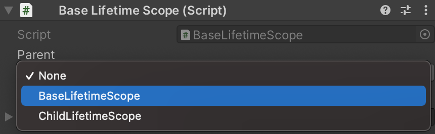

## How to make an Additive scene a child

### How to set the parent when loading a scene

You can parent it by specifying a `LifetimeScope` object before loading the scene.

```csharp
class SceneLoader
{
    readonly LifetimeScope parent;

    public SceneLoader(LifetimeScope lifetimeScope)
    {
        parent = lifetimeScope; // Inject the LifetimeScope to which this class belongs
    }

    IEnumerator LoadSceneAsync()
    {
        // LifetimeScope generated in this block will be parented by `this.lifetimeScope`
        using (LifetimeScope.EnqueueParent(parent))
        {
            // If this scene has a LifetimeScope, its parent will be `parent`.
            var loading = SceneManager.LoadSceneAsync("...", LoadSceneMode.Additive);
            while (!loading.isDone)
            {
                yield return null;
            }
        }
    }

    // UniTask example
    async UniTask LoadSceneAsync()
    {
        using (LifetimeScope.EnqueueParent(parent))
        {
            await SceneManager.LoadSceneAsync("...", LoadSceneMode.Additive);
        }
    }
}
```

LifetimeScope is a GameObject, so you can also search from the scene.

```csharp
var parent = LifetimeScope.Find<BaseLifetimeScope>();
```

#### How to add additional registers to the next scene

Often, you may want to add additional Registers to the loaded scenes.

For example, when context is finalized after assets are loaded asynchronously.

In that case you could use:

```csharp
// LifetimeScopes generated during this block will be additionally Registered.
using (LifetimeScope.Enqueue(builder =>
{
    // Register for the next scene not yet loaded
    builder.RegisterInstance(extraInstance);
}))
{
    // Loading the scene..
}
```

```csharp
// Use registration as type
class FooInstaller : IInstaller
{
    public void Install(IContainerBuilder builder)
    {
        builder.Register<ExtraType>(Lifetime.Scoped);
    }
}

using (LifetimeScope.Enqueue(fooInstaller)
{
    // ... loading scene
}
```

```csharp
// EnqueueParent() and Enqueue() can be used together.
using (LifetimeScope.EnqueueParent(parent))
using (LifetimeScope.Enqueue(builder => ...)
{
    // ... loading scene
}
```

## How to pre-set the parent in the Inspector

`LifetimeScope` can be serialized by specifying the type of parent.

In base scene.


In additional scene.



:::caution
When the scene becomes "isLoaded" state, an error will occur if the Parent Type set in the inspector is not found.
:::
